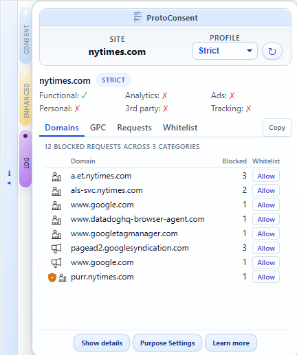
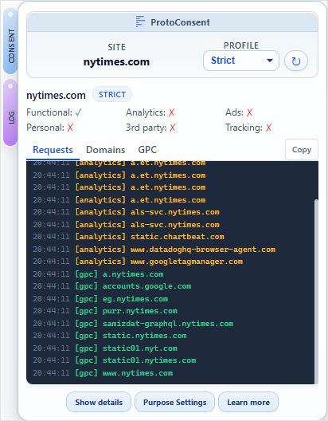
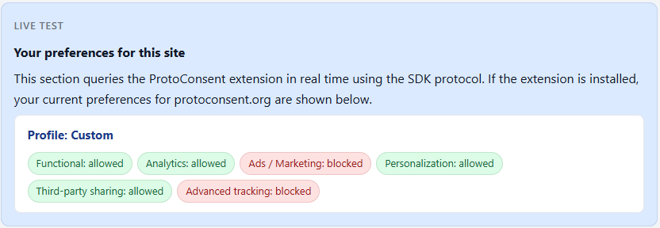
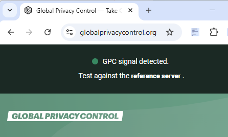
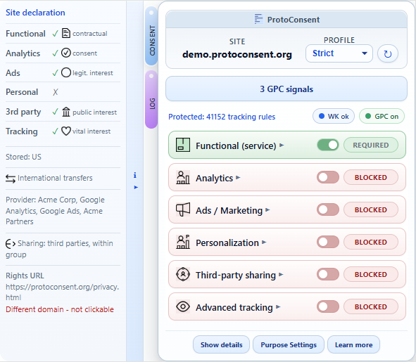

# ProtoConsent

  

<strong>One place to control how every website uses your data.</strong>

<em>User‑side, purpose‑based consent for the web.</em>

  

ProtoConsent is a browser extension that lets you control how websites may use your data — expressed in terms of purposes (functional, analytics, ads, personalisation, third‑party services, advanced tracking) rather than specific trackers or domains. It is not a full ad blocker or a traditional consent management platform (CMP) — it is a personal "consent control panel" that lives in the browser and can coexist with existing blockers and consent tools.

No central server, no tracking, no sharing of personal data. Preferences are enforced at the network level, per site, entirely from your browser.

**Project website:** <https://protoconsent.org> · **Live demo:** <https://demo.protoconsent.org>

> Pending review in Chrome Web Store, Edge Add-ons, and Opera Addons. In the meantime, install locally in developer mode on any Chromium-based browser. Firefox support planned.

## Key features

- **Per‑site profiles:** assign a trust level (Strict, Balanced, Permissive) to each website, then refine individual purposes if needed.
- **Purpose toggles** for six categories: functional, analytics, ads, personalisation, third‑party services, and advanced tracking.
- **Network‑level enforcement** via static rulesets: 40 000+ curated tracker domains and 1 200+ path‑based rules from public blocklists, organized by purpose. See [blocklists.md](design/blocklists.md) for sources and curation criteria.
- **Conditional [Global Privacy Control](https://globalprivacycontrol.org/)** (Sec‑GPC header and `navigator.globalPrivacyControl`), sent only when privacy‑relevant purposes are denied — per site, not globally.
- **Per‑purpose blocked request counter** with estimated performance impact, visible in the popup.
- **Log monitoring tab** with three sub-tabs: real-time request log, blocked domains grouped by purpose with Consent Commons icons, and GPC signal tracking per domain with timestamps. Includes a copy-to-clipboard button for all tabs.
- **Site declarations:** websites can publish a `.well-known/protoconsent.json` file declaring their data practices, displayed in a side panel with [Consent Commons](https://consentcommons.com/) icons.
- **JavaScript SDK** (MIT licensed) and content script bridge for web pages to query user preferences. TypeScript declarations included.
- **Onboarding** welcome page for first‑time users with profile selection.
- **Purpose settings** page for customizing the global default profile.

## Getting started

ProtoConsent is pending review in extension stores. To try it now:

1. Clone this repository.
2. Open `chrome://extensions/` (or `edge://extensions/`) and enable **Developer mode**.
3. Click **Load unpacked** and select the `extension/` folder (the one containing `manifest.json`).
4. Open any site and click the ProtoConsent icon in the toolbar.

On first install, an onboarding page will guide you through selecting a default privacy profile. You can then adjust per‑site settings from the popup at any time.

To see the extension in action without configuring anything, visit [demo.protoconsent.org](https://demo.protoconsent.org) — it includes a site declaration, an SDK live test, and a GPC signal check.

For step‑by‑step instructions and test scenarios, see [testing-guide.md](design/testing-guide.md).

## Screenshots

### Popup with per-site profile and purpose toggles

### Network-level blocking of tracking requests

Per-purpose blocking stats on a news site, with links to the Log tab for full domain-level detail:

### Log monitoring with blocked domains and GPC tracking

The Log tab shows real-time request activity, blocked domains grouped by purpose, and GPC signals per domain:

## For websites

ProtoConsent offers two ways for websites to participate — both optional, both privacy‑preserving:

- **Publish a site declaration:** serve a static `.well-known/protoconsent.json` file to declare your data practices (purposes, legal bases, providers, sharing scope). No SDK, no code changes — just a JSON file. See the [spec](design/well-known-spec.md) and the [demo site source](https://github.com/ProtoConsent/demo) for a complete example.
- **Integrate the SDK:** import `sdk/protoconsent.js` (MIT) and call `get('analytics')` to read the user's preferences. Returns `true`, `false`, or `null` (no extension). See the [quick example](design/protocol-draft.md#quick-example) and [SDK source](sdk/protoconsent.js).

## Architecture overview

ProtoConsent is a browser extension with a popup UI, a background service worker, and local storage for site rules and purpose preferences. Enforcement relies on declarative network rules in the browser.

See [architecture.md](design/architecture.md) for more details.

## Documentation

- **Product overview** – problem, solution, key features, roadmap, and openness: [product-overview.md](design/product-overview.md)
- **Technical architecture** – components, data model, main flows, and design choices: [architecture.md](design/architecture.md)
- **Purpose‑signalling protocol** – data model, communication mechanism, and SDK API surface: [protocol-draft.md](design/protocol-draft.md)
- **Site declaration spec** – `.well-known/protoconsent.json` format for websites: [well-known-spec.md](design/well-known-spec.md)
- **Blocklists management** – sources, curation process, and DNR format: [blocklists.md](design/blocklists.md)
- **How to test the extension** – installation, test scenarios for blocking, SDK, GPC, and site declarations: [testing-guide.md](design/testing-guide.md)
- **Icons and layers** – visual representation of profiles, purposes, and UI layers: [icons-and-layers.md](design/icons-and-layers.md)

## Goals

- Give users a single, consistent place to manage their privacy and consent preferences.
- Express preferences in terms of purposes of data use, not just domains, cookies or vendors.
- Keep control and identity in the user's browser by default, minimising or avoiding any server-side processing.
- Align with existing and emerging web privacy standards where possible (for example, Permissions API, Storage Access API, Global Privacy Control).
- Explore browser-level, purpose-based preference signals that other tools and standards discussions could build on.

## What's next

- Per-domain whitelist for quick false-positive recovery
- Import/export of user configuration
- Online validator for `.well-known/protoconsent.json` site declarations
- Firefox support

For a detailed product description and roadmap, see [product-overview.md](design/product-overview.md).

## More screenshots

### SDK live test on protoconsent.org

The project website includes a live test that shows your current preferences when the extension is installed:

### Global Privacy Control conditional signal

ProtoConsent sends a [Sec-GPC](https://globalprivacycontrol.org/) header only when privacy-relevant purposes are denied — per site, not globally:

### Site declaration with Consent Commons icons

Websites can publish a `.well-known/protoconsent.json` file to declare their data practices.
The popup displays this in a side panel with [Consent Commons](https://consentcommons.com/) icons.
See the complete example at [demo.protoconsent.org](https://demo.protoconsent.org):

## Use of Generative AI

This project occasionally uses generative AI tools for non-code tasks such as visuals, text translation, and spelling/grammar/orthography corrections. All project code and technical design are written and reviewed by human contributors, and the codebase is prepared as FLOS (GPL‑3.0‑or‑later) without "vibe-coding" or direct code generation from AI tools.

## License

ProtoConsent is free and open source software.

The browser extension and main code in this repository are licensed under the GNU General Public License, version 3 or (at your option) any later version (see [LICENSE](LICENSE)).

The JavaScript SDK (for example, files under `sdk/`) is licensed under the MIT License to make integration easier for third‑party services (see [sdk/LICENSE](sdk/LICENSE)).

Project documentation (for example, files under `design/` and `*.md` files in this repository) is licensed under the Creative Commons Attribution-ShareAlike 4.0 International (CC BY-SA 4.0) license (see [LICENSE-CC-BY-SA](LICENSE-CC-BY-SA)).
