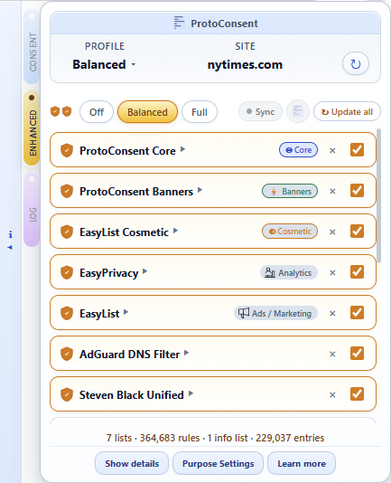
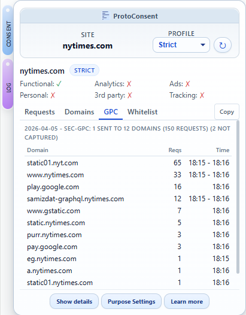
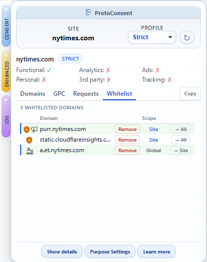

# ProtoConsent

  

<strong>Consent you can express, enforce and observe</strong>

<em>User‑side, purpose‑based consent for the web</em>

  

ProtoConsent is a browser extension that lets you control how websites may use your data, expressed in terms of purposes (functional, analytics, ads, personalisation, third‑party services, advanced tracking) rather than specific trackers or domains. Not a full ad blocker, not a CMP: a personal consent control panel that lives in the browser and can coexist with existing blockers and consent tools.

No central server, no tracking, no sharing of personal data. Everything stays in your browser.

**Project website:** <https://protoconsent.org> · **Live demo:** <https://demo.protoconsent.org>

> Pending review in Chrome Web Store, Edge Add-ons, and Opera Addons. In the meantime, install locally in developer mode on any Chromium-based browser. Firefox support planned.

## Key features

- **Per‑site profiles and purpose toggles:** assign a trust level (Strict, Balanced, Permissive) to each website and refine individual purposes (functional, analytics, ads, personalisation, third‑party services, advanced tracking).
- **Network‑level enforcement** of purpose‑based decisions via curated blocklists organised by purpose, with visible results (blocked counts, domain detail). See [blocklists.md](design/blocklists.md).
- **Optional enhanced protection** with 14 curated third-party enhanced lists (EasyList, EasyPrivacy, AdGuard, HaGeZi, Steven Black, OISD, 1Hosts, Blocklist Project, AdGuard CNAME Trackers) including cosmetic filtering (element-hiding CSS). Three presets (Off, Balanced, Full) or individual list selection. Remote fetch gated behind an explicit consent toggle. Consent-enhanced link optionally auto-activates lists matching denied purposes.
- **Conditional [Global Privacy Control](https://globalprivacycontrol.org/)** (Sec‑GPC), sent only when privacy‑relevant purposes are denied, per site, not globally.
- **Visibility:** real‑time log monitoring, blocked domains grouped by purpose with [Consent Commons](https://consentcommons.com/) icons, GPC signal tracking, Client Hints status, cookie consent detection, CNAME trackers and domain whitelist management.
- **Site declarations:** websites can publish a `.well-known/protoconsent.json` to declare their data practices. No SDK or code changes required.
- **JavaScript SDK** (MIT licensed) for web pages to query user preferences. TypeScript declarations included.

For a detailed feature breakdown, see [product-overview.md](design/product-overview.md).

## Getting started

ProtoConsent is pending review in extension stores. To try it now:

1. Clone this repository.
2. Open `chrome://extensions/` (or `edge://extensions/`) and enable **Developer mode**.
3. Click **Load unpacked** and select the `extension/` folder (the one containing `manifest.json`).
4. Open any site and click the ProtoConsent icon in the toolbar.

On first install, a four-screen onboarding page will guide you through selecting a default privacy profile and opting into Enhanced lists features. You can then adjust per-site settings from the popup at any time.

To see the extension in action without configuring anything, visit [demo.protoconsent.org](https://demo.protoconsent.org). It includes a site declaration, an SDK live test, and a GPC signal check.

For step‑by‑step instructions and test scenarios, see [testing-guide.md](design/testing-guide.md).

## Screenshots

<table>
<tr>
<td align="center" width="50%"></td>
<td align="center" width="50%"></td>
</tr>
<tr>
<td align="center"></td>
<td align="center"></td>
</tr>
</table>
<table>
<tr>
<td align="center"></td></table>

### Domain whitelist management

The Domains tab includes Allow/Allowed buttons for quick whitelist control. The Whitelist tab lists all whitelisted domains with scope (Site or Global) and toggle buttons.

<table>
<tr>
<td align="center"></td>
</table>

## For websites

ProtoConsent offers two ways for websites to participate, both optional:

- **Publish a site declaration:** serve a static `.well-known/protoconsent.json` file to declare your data practices (purposes, legal bases, providers, sharing scope). No SDK, no code changes, just a JSON file. See the [spec](design/spec/protoconsent-well-known.md), the [demo site source](https://github.com/ProtoConsent/demo) for a complete example, and the [online validator](https://protoconsent.org/validate.html) to check your file.
- **Integrate the SDK:** import `sdk/protoconsent.js` (MIT) and call `get('analytics')` to read the user's preferences. Returns `true`, `false`, or `null` (extension not installed). See the [quick example](design/spec/signalling-protocol.md#quick-example) and [SDK source](sdk/protoconsent.js).

For a visual walkthrough of both paths, see [protoconsent.org/developers](https://protoconsent.org/developers.html).

## Architecture

See [architecture.md](design/architecture.md) for the full technical description.

## Documentation

**Concepts and design**
- [Design rationale](design/design-rationale.md) – premises, trade‑offs, boundaries, and non‑goals
- [Product overview](design/product-overview.md) – problem, solution, features, scope, and roadmap

**Specifications**
- [Purpose‑signalling protocol](design/spec/signalling-protocol.md) – data model, communication mechanism, SDK API
- [Site declaration spec](design/spec/protoconsent-well-known.md) – `.well-known/protoconsent.json` format
- [Blocklists methodology](design/blocklists.md) – sources, curation, DNR format, enhanced lists

**Implementation**
- [Technical architecture](design/architecture.md) – components, data model, flows, design decisions
- [Testing guide](design/testing-guide.md) – installation, test scenarios
- [Icons and layers](design/icons-and-layers.md) – visual language and icon mapping

## What's next

- Import/export of user configuration
- `.well-known/protoconsent.json` declaration generator
- Core blocklist refresh and expansion
- Ecosystem outreach (pilot sites with `.well-known` declarations)

See [product-overview.md](design/product-overview.md) for the full roadmap.

## Use of Generative AI

This project occasionally uses generative AI tools for non-code tasks such as visuals, translation, and spelling corrections. All code and technical design are written and reviewed by human contributors, and the codebase is prepared as FLOS (GPL‑3.0‑or‑later) without "vibe-coding" or direct code generation from AI tools.

## License

ProtoConsent is free and open source software.

The browser extension and main code in this repository are licensed under the GNU General Public License, version 3 or (at your option) any later version (see [LICENSE](LICENSE)).

The JavaScript SDK (files under `sdk/`) is licensed under the MIT License to make integration easier for third‑party services (see [sdk/LICENSE](sdk/LICENSE)).

Project documentation (files under `design/` and `*.md` files in this repository) is licensed under the Creative Commons Attribution-ShareAlike 4.0 International (CC BY-SA 4.0) license (see [LICENSE-CC-BY-SA](LICENSE-CC-BY-SA)).
