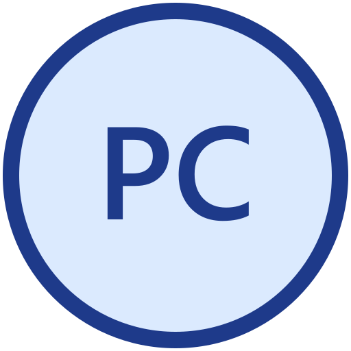
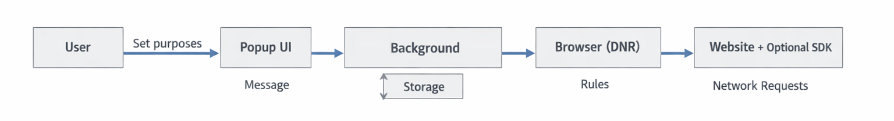
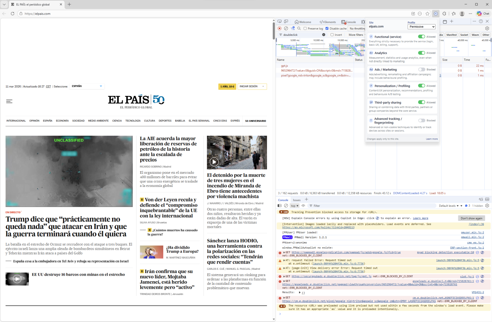

# ProtoConsent

  

<em>User‑side, purpose‑based consent for the web.</em>

  

ProtoConsent is a browser extension to control how websites may use your data, expressed in terms of purposes from inside your browser (for example functional, analytics, ads, personalisation, third‑party services, and advanced tracking).

No central server, no tracking, no sharing of personal data — everything stays in your browser by default.

Instead of focusing on specific trackers or ad slots, ProtoConsent lets you express preferences in terms of data-use purposes and enforces those preferences at the network level, per site, from inside your browser.

**Project website:** https://www.protoconsent.org

> Status: early alpha, meant for exploration and feedback, not production use yet (baseline v0.1.0). Visuals and logo are provisional and will likely change as the project matures.

## What is ProtoConsent?

ProtoConsent is a browser extension (initially for Chromium-based browsers, with Firefox support planned) that:

- Stores the user’s data-use preferences per site and per purpose (for example: functional, analytics, ads, personalisation, third-party services, advanced tracking).
- Enforces those preferences by blocking or allowing network requests associated with each purpose.
- Keeps all decisions and identity local to the browser by default: no central server, no tracking, no sharing of personal data.

ProtoConsent is not a full ad blocker or a traditional consent management platform (CMP). It is a personal “consent control panel” that lives in the browser and can coexist with existing blockers and consent tools.

In later versions, websites that choose to respect ProtoConsent may be able to read a minimal, privacy-preserving signal from the browser (for example, “analytics allowed/denied for this site”), without learning any real-world identity or cross-site tracking identifier.

## Goals

- Give users a single, consistent place to manage their privacy and consent preferences.
- Express preferences in terms of purposes of data use, not just domains, cookies or vendors.
- Keep control and identity in the user’s browser by default, minimising or avoiding any server-side processing.
- Align with existing and emerging web privacy standards where possible (for example, Permissions API, Storage Access API, Global Privacy Control).
- Explore browser-level, purpose-based preference signals that other tools and standards discussions could build on.

## Project status

ProtoConsent is currently in early design and prototyping. A first Chromium-based extension already exists with per-site profiles, purpose toggles, and basic blocking of common analytics and ads resources.

ProtoConsent is in early alpha, meant for exploration and feedback, not production use yet (baseline v0.1.0). The current milestone is a minimal browser extension that provides:

- Local settings storage in the browser.
- Per-site profiles and purpose toggles in a browser action popup.
- Blocking of common tracking and analytics resources according to those toggles.

For a more detailed roadmap and planned features, see [product-overview.md](docs/product-overview.md). Expect the code and documentation to change quickly at this stage.

## Architecture overview

ProtoConsent is a browser extension with a popup UI, a background service worker, and local storage for site rules and purpose preferences. Enforcement relies on declarative network rules in the browser.

See [architecture.md](docs/architecture.md) for more details.

## Screenshots

ProtoConsent popup with per-site profile and purpose toggles:

Basic blocking of tracking resources for the Ads purpose on a news site.
Notice the missing ad slots in the page header and `ERR_BLOCKED_BY_CLIENT` entries in the console panel:

## Getting started (developer mode)

For now ProtoConsent is only available as an unpacked extension.

- Clone this repository locally.
- Load the folder as an unpacked extension in your Chromium-based browser   (Chrome, Edge, Brave) with Developer mode enabled.
- Open any site, click the ProtoConsent icon, pick a profile and adjust the per‑purpose toggles.

For step‑by‑step instructions and example test scenarios, see [testing-guide.md](docs/testing-guide.md).

## Documentation

ProtoConsent comes with a small set of public documents that describe the project from different angles:

- **Product overview** – high-level description of the problem, solution, key features, roadmap, and openness: see [product-overview.md](docs/product-overview.md).
- **Technical architecture** – components, data model, main flows, and design choices: see [architecture.md](docs/architecture.md).
- **Icons and layers** – visual representation of profiles, purposes, and UI layers: see [icons-and-layers.md](docs/icons-and-layers.md).
- **How to test the extension** – practical steps to install the extension in developer mode and try it on real sites: see [testing-guide.md](docs/testing-guide.md).

## Use of Generative AI

This project occasionally uses generative AI tools for non-code tasks such as visuals, text translation, and spelling/grammar/orthography corrections. All project code and technical design are written and reviewed by human contributors, and the codebase is prepared as FLOS (GPL‑3.0‑or‑later) without “vibe-coding” or direct code generation from AI tools.

## License

ProtoConsent is free and open source software.

The browser extension and main code in this repository are licensed under the GNU General Public License, version 3 or (at your option) any later version (see [LICENSE](LICENSE)).

The JavaScript SDK (for example, files under `sdk/`) is licensed under the MIT License to make integration easier for third‑party services (see [sdk/LICENSE](sdk/LICENSE)).

Project documentation (for example, files under `docs/` and `*.md` files in this repository) is licensed under the Creative Commons Attribution-ShareAlike 4.0 International (CC BY-SA 4.0) license (see [LICENSE-CC-BY-SA](LICENSE-CC-BY-SA)).
