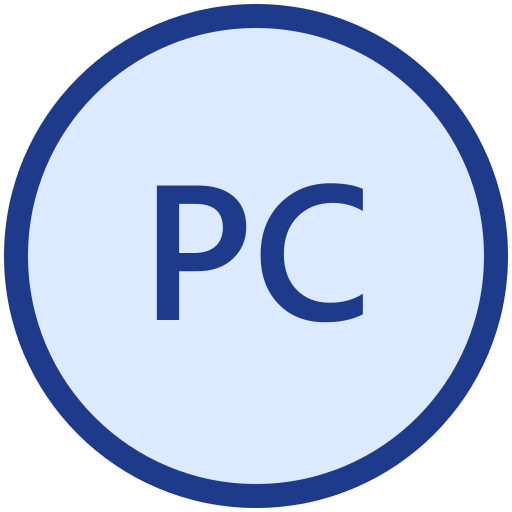
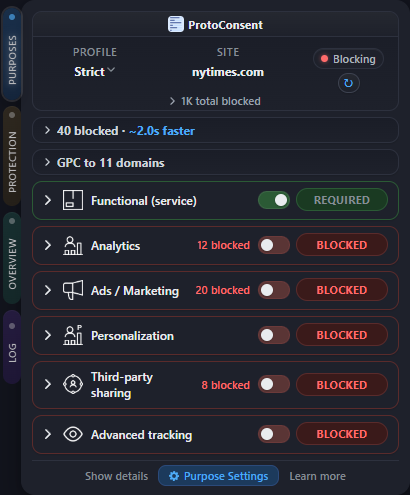
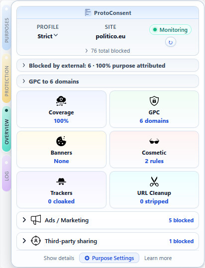
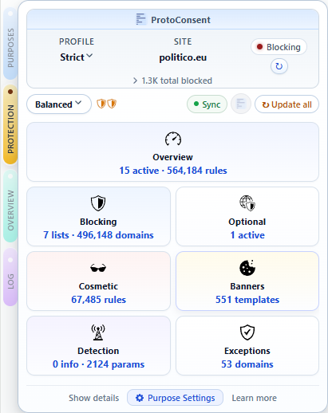
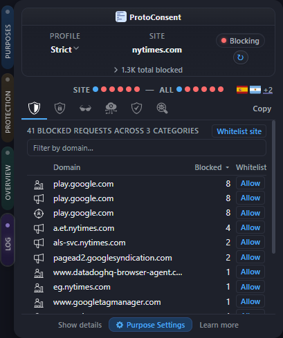
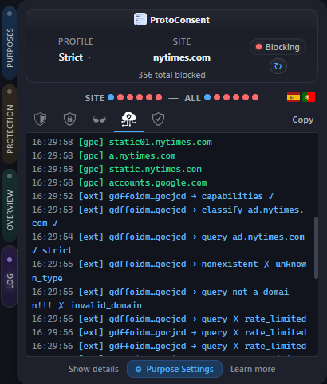
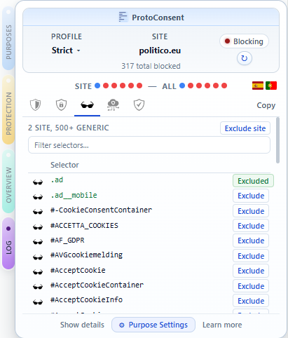
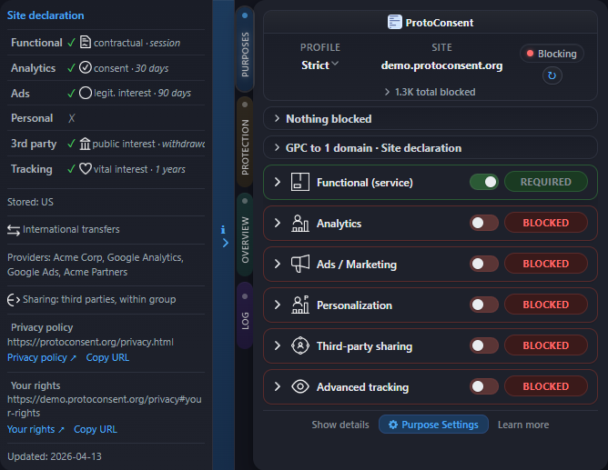
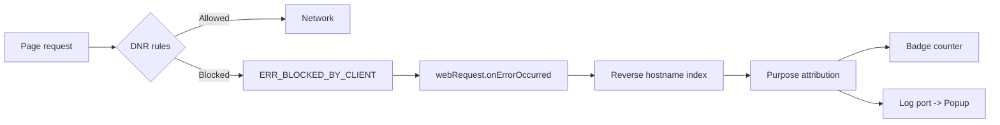

# ProtoConsent

  

<strong>Consent you can express, enforce and observe</strong>

<em>User‑side, purpose‑based consent for the web</em>

  <a href="https://github.com/ProtoConsent/ProtoConsent"><strong>Browser extension</strong></a> &middot;
  <a href="https://github.com/ProtoConsent/data"><strong>Blocklists</strong></a> &middot;
  <a href="https://protoconsent.org"><strong>Website</strong></a>

  
  
  
  
  

ProtoConsent is a browser extension that lets you control how websites may use your data. You set your preferences once - by purpose - and the extension enforces them across every site you visit.

A personal consent control panel that lives in the browser. Purpose-based blocking, tracker detection, and signal management in one place - can coexist with existing blockers and consent tools. Works out of the box with no configuration needed.

No central server, no tracking, no sharing of personal data. Everything stays in your browser.

**Project website:** <https://protoconsent.org> · **Live demo:** <https://demo.protoconsent.org>

  
  &nbsp;
  

   <em>Brave via Chrome Web Store</em>
  &nbsp;&nbsp;
   <em>Mozilla Firefox - in review</em>
  &nbsp;&nbsp;
   <em>Opera Addons - in review</em>

<em>Also works on Vivaldi, Arc, and any Chromium-based browser.</em>

You can also install locally in developer mode.

## Key features

- **Per-site profiles and purpose toggles:** choose a default privacy profile (Strict, Balanced, Permissive) that applies everywhere, then feel free to override per site and refine individual purposes (functional, analytics, ads, personalization, third-party services, advanced tracking).
- **Enhanced protection out of the box:** curated blocklists, cosmetic filtering, CNAME detection, URL parameter stripping, and regional filters for 36 languages - all enabled by default and kept up to date automatically.
- **Two operating modes:** Blocking (default, full enforcement) or Monitoring (delegates blocking to your existing ad blocker while ProtoConsent adds purpose attribution, coverage metrics, and signal observability).
- **Consent banner handling:** cosmetic hiding, scroll unlock, and experimental cookie injection to auto-respond to consent banners based on your purpose preferences. No DOM interaction, no click simulation.
- **Conditional [Global Privacy Control](https://globalprivacycontrol.org/):** Sec-GPC sent only when privacy-relevant purposes are denied, per site, with legal weight under CCPA/CPRA.
- **Site declarations and SDK:** websites can publish a `.well-known/protoconsent.json` to declare their data practices, or use the [SDK](sdk/protoconsent.js) (MIT) to read user preferences. Both optional.
- **Inter-extension API:** other browser extensions can query the user's consent state. See the [protocol spec](design/spec/inter-extension-protocol.md).

For a detailed feature breakdown, see [product-overview.md](design/product-overview.md).

## Getting started

ProtoConsent is available on the [Chrome Web Store](https://chromewebstore.google.com/detail/protoconsent/dkcdkdcclhofocmkecccmikkfmfgfdlb) and the [Edge Add-ons Store](https://microsoftedge.microsoft.com/addons/detail/protoconsent/djghmcahfjgmeiocpgkdgengofconfoo). To try the latest development version:

1. Clone this repository.
2. Open `chrome://extensions/` (or `edge://extensions/`) and enable **Developer mode**.
3. Click **Load unpacked** and select the `extension/` folder (the one containing `manifest.json`).
4. Open any site and click the ProtoConsent icon in the toolbar.

On first install, a two-step onboarding page will guide you through selecting a default privacy profile. Enhanced protection lists are enabled by default and download automatically in the background. You can then adjust per-site settings from the popup at any time.

To see the extension in action without configuring anything, visit [demo.protoconsent.org](https://demo.protoconsent.org). It includes a site declaration, an SDK live test, and a GPC signal check.

For step‑by‑step instructions and test scenarios, see [testing-guide.md](design/testing-guide.md).

## Screenshots

<table>
<tr>
<td align="center" width="50%"></td>
<td align="center" width="50%"></td>
</tr>
<tr>
<td align="center" width="50%"></td>
<td align="center" width="50%"></td>
</tr>
<tr>
<td align="center" width="50%"></td>  
<td align="center" width="50%"></td>
</tr>
</table>

### Site declaration

Websites can publish a `.well-known/protoconsent.json` to declare their data practices. The extension displays it in a side panel with [Consent Commons](https://consentcommons.com/) icons alongside the user's own preferences.

<table>
<tr>
<td align="center"></td>
</tr>
</table>

## For websites

ProtoConsent offers two ways for websites to participate, both optional:

- **Publish a site declaration:** serve a static `.well-known/protoconsent.json` file to declare your data practices (purposes, legal bases, providers, retention, sharing scope). No SDK, no code changes, just a JSON file. See the [spec](design/spec/protoconsent-well-known.md), the [JSON Schema](design/spec/protoconsent.schema.json), the [demo site source](https://github.com/ProtoConsent/demo) for a complete example, or use the online tools: [generator](https://protoconsent.org/generate.html), [validator](https://protoconsent.org/validate.html), [CI action](https://github.com/ProtoConsent/validate-action).
- **Integrate the SDK:** import `sdk/protoconsent.js` (MIT) and call `get('analytics')` to read the user's preferences. Returns `true`, `false`, or `null` (extension not installed). See the [quick example](design/spec/signalling-protocol.md#quick-example) and [SDK source](sdk/protoconsent.js).
- **List your site in the directory:** if your site already serves a declaration, [add it to the public directory](https://github.com/ProtoConsent/protoconsent.org/issues/new?template=add-site.yml) — your file will be validated automatically. Browse the [directory](https://protoconsent.org/directory.html).

For a visual walkthrough of both paths, see [protoconsent.org/developers](https://protoconsent.org/developers.html).

## Architecture

```mermaid
flowchart LR
    P[Page request] --> DNR{DNR rules}
    DNR -->|Allowed| N[Network]
    DNR -->|Blocked| E[ERR_BLOCKED_BY_CLIENT]
    E --> WR[webRequest.onErrorOccurred]
    WR --> RI[Reverse hostname index]
    RI --> A[Purpose attribution]
    A --> Badge[Badge counter]
    A --> Log[Log port -> Popup]
```

See [architecture.md](design/architecture.md) for the full technical description and flow diagrams.

## Documentation

**Concepts and design**
- [Design rationale](design/design-rationale.md) – premises, trade‑offs, boundaries, and non‑goals
- [Product overview](design/product-overview.md) – problem, solution, features, scope, and roadmap

**Specifications**
- [Purpose-signalling protocol](design/spec/signalling-protocol.md) - communication mechanism, SDK API
- [Data model](design/spec/data-model.md) - purpose taxonomy, profiles, consent state
- [Site declaration spec](design/spec/protoconsent-well-known.md) - `.well-known/protoconsent.json` format
- [Inter-extension protocol](design/spec/inter-extension-protocol.md) - cross-extension consent queries, TOFU trust model
- [JSON Schema](design/spec/protoconsent.schema.json) - machine-readable schema for `protoconsent.json`

**Implementation**
- [Technical architecture](design/architecture.md) - components, data model, flows, design decisions
- [CMP auto-response](design/architecture/cmp-auto-response.md) - consent banner handling, CMP signatures, TC String generation
- [Operating modes](design/architecture/operating-modes.md) - Blocking vs Monitoring, capabilities, coverage metrics
- [URL parameter stripping](design/architecture/param-stripping.md) - detection, data model, observability
- [List catalog](design/architecture/list-catalog.md) - sources, curation, rule format, enhanced lists
- [Testing guide](design/testing-guide.md) - installation, test scenarios

## What's next

See [product-overview.md](design/product-overview.md) for the roadmap.

## Use of Generative AI

This project occasionally uses generative AI tools for non-code tasks such as visuals, translation, and spelling corrections. All code and technical design are written and reviewed by human contributors, and the codebase is prepared as FLOS (GPL‑3.0‑or‑later) without "vibe-coding" or direct code generation from AI tools.

## License

ProtoConsent is free and open source software.

The browser extension and main code in this repository are licensed under the GNU General Public License, version 3 or (at your option) any later version (see [LICENSE](LICENSE)).

The JavaScript SDK (files under `sdk/`) is licensed under the MIT License to make integration easier for third‑party services (see [sdk/LICENSE](sdk/LICENSE)).

Project documentation (files under `design/` and `*.md` files in this repository) is licensed under the Creative Commons Attribution-ShareAlike 4.0 International (CC BY-SA 4.0) license (see [LICENSE-CC-BY-SA](LICENSE-CC-BY-SA)).
