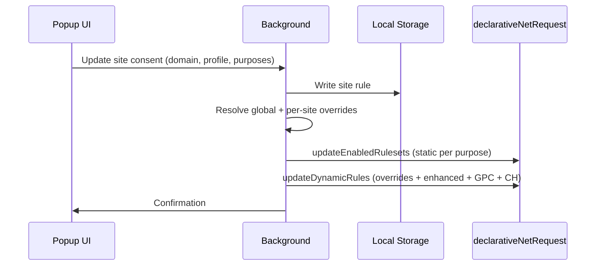
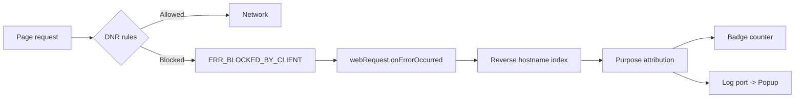
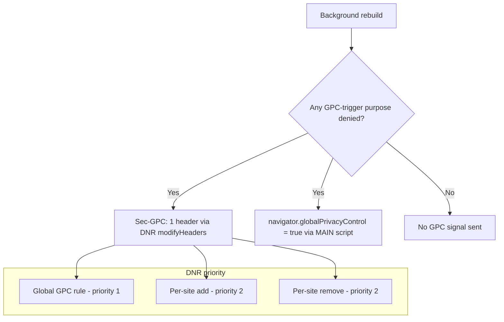

# ProtoConsent: Technical architecture

This document is part of the ProtoConsent project and is licensed under the Creative Commons Attribution-ShareAlike 4.0 International (CC BY-SA 4.0) license. See the repository README and the [LICENSE-CC-BY-SA](../LICENSE-CC-BY-SA) file for details.

## 1. Overview

ProtoConsent is a client‑side system that adds purpose‑based privacy controls to the browser. It is implemented as a browser extension that stores all user rules locally and uses standard browser capabilities to enforce them. There is no central server: everything happens on the user’s device.

The extension provides a popup interface to manage profiles and purposes per site, and a background component that translates those choices into declarative network rules. A JavaScript SDK and a content script bridge allow websites to read the user’s choices and adapt accordingly.

## Contents

- [ProtoConsent: Technical architecture](#protoconsent-technical-architecture)
  - [1. Overview](#1-overview)
  - [Contents](#contents)
  - [2. Components](#2-components)
  - [3. Data model](#3-data-model)
  - [4. Main flows](#4-main-flows)
    - [Flow 1: Settings change and DNR rebuild](#flow-1-settings-change-and-dnr-rebuild)
    - [Flow 2: Request blocking and attribution](#flow-2-request-blocking-and-attribution)
    - [Flow 3: Real-time monitoring](#flow-3-real-time-monitoring)
  - [5. Security and privacy by design](#5-security-and-privacy-by-design)
  - [6. Permissions rationale](#6-permissions-rationale)
  - [7. Chrome declarativeNetRequest: priority and limits](#7-chrome-declarativenetrequest-priority-and-limits)
    - [Priority resolution](#priority-resolution)
    - [`requestDomains` matching](#requestdomains-matching)
    - [`initiatorDomains` matching](#initiatordomains-matching)
    - [Resource limits](#resource-limits)
  - [8. Design decisions](#8-design-decisions)
    - [Advanced tracking is always blocked](#advanced-tracking-is-always-blocked)
    - [Iframe initiator behaviour](#iframe-initiator-behaviour)
    - [Override grouping for scalability](#override-grouping-for-scalability)
    - [`main_frame` exclusion](#main_frame-exclusion)
    - [Path‑domain filtering in block overrides](#pathdomain-filtering-in-block-overrides)
  - [9. Extensibility](#9-extensibility)
  - [10. Global Privacy Control (GPC)](#10-global-privacy-control-gpc)
    - [Relation to the GPC specification](#relation-to-the-gpc-specification)
  - [11. Site declaration behaviour](#11-site-declaration-behaviour)
  - [12. Inter-extension provider API](#12-inter-extension-provider-api)
  - [13. CMP auto-response and banner observation](#13-cmp-auto-response-and-banner-observation)
  - [14. Operating modes](#14-operating-modes)
  - [15. URL parameter stripping](#15-url-parameter-stripping)

## 2. Components

### 2.1 Popup UI

The main user-facing element. When opened on a site, it shows the active profile and purpose states for that domain, and lets the user switch profiles or toggle purposes. Purpose categories are shown with [Consent Commons](https://consentcommons.com/) icons. The popup does not enforce anything directly; it sends messages to the background component when settings change.

- **Purposes view**: purpose toggles and per-purpose blocked stats
- **Overview view**: operating mode dashboard showing signal status (GPC, CMP detection, cosmetic filtering), purpose-attributed blocks as accordion cards, CMP auto-response state, URL parameter stripping summary, and unattributed hostnames. Auto-refreshes while active.
- **Protection view**: optional third-party blocklists with preset selection and per-list controls
- **Log view**: real-time request monitoring, blocked domains grouped by purpose, GPC signal tracking per domain, and URL parameter strip events
- **Site declaration panel**: when a site publishes a `.well-known/protoconsent.json`, a collapsible side panel shows its declared purposes, legal basis, sharing and international transfers

### 2.2 Background script (service worker)

Central coordination point. Does not render UI; receives messages from popup and content scripts and translates them into enforcement actions.

- **Rule management**: maintains per-site rules, computes defaults for new domains, rebuilds DNR rules (static rulesets + dynamic overrides) on every settings change
- **GPC signal**: manages conditional `Sec-GPC: 1` header rules and registers the MAIN-world content script for `navigator.globalPrivacyControl`
- **Client Hints stripping**: adds/removes `modifyHeaders` rules for high-entropy `Sec-CH-UA-*` headers based on `advanced_tracking` state
- **Enhanced Protection**: downloads lists on demand, builds dynamic block rules, handles consent-enhanced link overlay, compiles cosmetic CSS and registers the injection content script
- **Inter-extension API**: responds to queries from approved extensions (§12)
- **Observability**: tracks blocked requests, GPC signals, and URL parameter strips, maintains per-tab counters, updates badge, pushes real-time events to the Log tab
- **Site declarations**: fetches `.well-known/protoconsent.json` on behalf of the popup and caches results (24h success, 6h failure)
- **TCF detection**: receives CMP data from the content script bridge, validates and stores it per tab
- **Onboarding**: opens the welcome page on first install when no default profile exists

### 2.3 Local storage

All configuration lives in the browser’s extension storage. No remote server is used.

- **Site rules**: mapping from domains to rules (profile plus purpose overrides) and predefined profiles
- **Domain whitelist**: per-site and global allow entries
- **Enhanced Protection**: list metadata, domain/path data, active preset, and selected regional languages. 15 non-regional lists: 6 ProtoConsent Core (one per blocking purpose plus security, maintained by the project) and 9 third-party from open-source projects, plus 2 regional catalog entries (13 regions x 2 types, language-gated). Core lists are bundled for first-install availability and updated weekly via CDN from the [data repository](https://github.com/ProtoConsent/data), where a GitHub Actions workflow refreshes all sources every Tuesday.
- **Cosmetic filtering**: compiled CSS for generic selectors and per-domain selectors
- **Opt-in flags**: remote sync consent and consent-enhanced link

### 2.4 Enforcement (declarativeNetRequest + GPC)

The background component uses a two-tier rule model to balance scalability with flexibility:

*Static rulesets* handle global blocking. Each of the five blocking purposes (analytics, ads, personalization, third_parties, advanced_tracking) has two static rulesets declared in the manifest: one for domain-based rules and one for path-based rules. All start disabled; the background script enables or disables each ruleset based on the user’s global profile. Because static rulesets draw from a separate Chrome-managed pool (up to 30,000 rules), they leave the dynamic rule budget available for per-site customisation.

```text
Static rulesets (30,000 rule pool)
┌────────────────────────────┐  ┌───────────────────────────────┐
│ Domain rules (per purpose) │  │ Path rules (per purpose)      │
│ 1 rule, N domains each     │  │ M rules, urlFilter each       │
│ requestDomains             │  │ e.g. ||google.com/pagead/     │
│ priority 1                 │  │ priority 1                    │
└────────────────────────────┘  └───────────────────────────────┘
     × 5 purposes                  × 5 purposes

Dynamic rules (5,000 rule pool)
┌──────────────────────────────────────────────┐
│ Per-site overrides: max 10 rules (priority 2)│
│ Enhanced lists:     N rules     (priority 2) │
│ Whitelist allow:    1+ rules    (priority 3) │
│ GPC global: 1 rule              (priority 1) │
│ GPC per-site: max 2 rules       (priority 2) │
│ CH strip global: 1 rule         (priority 1) │
│ CH strip per-site: max 1 rule   (priority 2) │
└──────────────────────────────────────────────┘
```

*Domain-based rules* use a single rule per category with a `requestDomains` array listing all tracker domains for that purpose. Chrome matches subdomains automatically, so listing `doubleclick.net` also blocks `static.doubleclick.net`.

*Path-based rules* complement domain rules for high-value domains that cannot be blocked entirely: `google.com`, `facebook.com`, or `linkedin.com`. These rules use `urlFilter` patterns (e.g. `||google.com/pagead/`, `||facebook.com/tr/`) to block specific tracking endpoints while allowing the rest of the domain. See [list-catalog.md](architecture/list-catalog.md) §4 for details.

*Dynamic rules* handle per-site customisation and Enhanced Protection.

- **Per-site overrides**: when a user configures a site differently from the global profile, the background creates override rules at priority 2. Overrides are grouped by (category, action) rather than by site: one "allow ads" rule covers all permissive sites via `initiatorDomains`, keeping the dynamic rule count constant regardless of how many custom sites exist.
- **Enhanced Protection**: each enabled list produces dynamic block rules at priority 2 - one domain rule and optional path rules. Sites where all purposes are allowed are excluded via `excludedInitiatorDomains`.
- **Consent-enhanced link**: when active, lists whose category matches a denied consent purpose are included in the rebuild even if the user has not manually enabled them. This is a runtime overlay computed fresh on each rebuild, not a persistent storage change.

This design supports hundreds of custom sites and multiple enhanced lists within Chrome’s 5,000 dynamic rule limit.

*Whitelist allow rules* let users unblock specific domains that were caught by the static rulesets. These rules use priority 3, so they always win over both static blocks (priority 1) and per-site overrides (priority 2). Each entry can be scoped per site or global. Global entries are batched into a single rule; per-site entries are grouped by site, one rule per unique site. Domain validation prevents invalid hostnames from entering storage or DNR rules, and storage writes are serialized to avoid concurrent conflicts.

*Global Privacy Control (GPC)* is managed by ProtoConsent. When privacy-relevant purposes (marked as GPC triggers in the purpose configuration) are denied, the extension injects a conditional `Sec-GPC: 1` header via `modifyHeaders` rules and sets `navigator.globalPrivacyControl` via a MAIN-world content script, signalling the user’s opt-out to the receiving server. Per-site overrides ensure that GPC is only sent where the user’s preferences call for it. Users can also disable GPC entirely via a global toggle in Purpose Settings; when off, no GPC headers or content scripts are generated regardless of purpose state.

Per-site GPC overrides use `requestDomains` (the destination URL), not `initiatorDomains` (the page making the request). This means that trusting a site, for example allowing all purposes on elpais.com, removes the GPC signal from requests *to* elpais.com, but third-party requests *from* elpais.com to domains like google-analytics.com still carry the global GPC signal. The same applies to cross-origin iframes: an iframe from youtube.com embedded on a trusted elpais.com page still receives GPC from the global rule.

*Client Hint headers* are handled automatically when the `advanced_tracking` purpose is denied. The extension strips seven high-entropy headers via `modifyHeaders` remove rules:

- Stripped: `Sec-CH-UA-Full-Version-List`, `Sec-CH-UA-Platform-Version`, `Sec-CH-UA-Arch`, `Sec-CH-UA-Bitness`, `Sec-CH-UA-Model`, `Sec-CH-UA-WoW64`, `Sec-CH-UA-Form-Factors` (~33 bits of entropy, enough to uniquely fingerprint)
- Kept: `Sec-CH-UA`, `Sec-CH-UA-Mobile`, `Sec-CH-UA-Platform` (low-entropy, needed for content negotiation)
- Global toggle in Purpose Settings; when off, no stripping rules are generated
- Per-site exceptions use `excludedRequestDomains` on the global rule rather than a separate override, because a native browser header cannot be "un-removed" by a higher-priority rule
- Firefox and Safari do not send Client Hints at all, so stripping is Chromium-specific

### 2.5 Content scripts

**Content script bridge** - A content script declared in the manifest runs in the ISOLATED world on every page. It acts as a message bridge between the page-level SDK and the extension’s background: it listens for query messages from the page, forwards them to the background via `chrome.runtime.sendMessage`, and relays the response back. It also forwards TCF detection messages from the MAIN-world script to the background. It does not access or modify page content.

**TCF detection script** - A MAIN-world content script that detects IAB TCF consent management platforms on the page.

- Probes for the `__tcfapi` function, retrying at increasing intervals to handle async-loaded CMPs
- When found, reads CMP identity and purpose consent state via `getTCData`
- Sends data to the background via the content script bridge
- Background validates (numeric ranges, boolean values, entry count limits) and stores per tab in memory and session storage
- Popup shows a pill indicator; clicking it reveals CMP provider, purpose consent details, and a note that ProtoConsent enforces independently
- Data is cleared on navigation (full loads and SPA pushState changes) and on tab close; orphan session keys are pruned during service worker restore

### 2.6 SDK and inter-extension API

**protoconsent.js SDK** - A small, optional JavaScript library for web pages to read the user’s ProtoConsent preferences (e.g. whether analytics is allowed) via the content script bridge. The extension works without it; the SDK is for sites that want to adapt their behaviour to the user’s choices. TypeScript type declarations are also provided.

**Inter-extension provider** - The background script also acts as a consent provider for other browser extensions. Extensions like Consent-O-Matic or uBlock Origin can query ProtoConsent’s resolved purpose state for any domain via `chrome.runtime.sendMessage`. The API is disabled by default and gated by a per-extension allowlist (Trust on First Use): the user must enable the feature and individually approve each consumer extension. Consumers can query but never modify preferences. The Purpose Settings page provides the management UI (master switch, pending/allow/deny lists), and all API events appear in the Log tab’s Requests stream for observability. See §12 for details.

### 2.7 Extension pages

**Onboarding** - Opens on first install and guides new users through four screens: (1) default profile selection, (2) feature overview, (3) Enhanced lists opt-ins (remote sync and consent-enhanced link), and (4) confirmation with next steps.

**Purpose settings** - Lets users customise the global default profile by toggling individual purposes, manage Enhanced lists (sync toggle and consent-enhanced link toggle), and shows the active Enhanced Protection preset alongside the consent presets. Accessible from the popup or the browser’s extensions page.

### 2.8 Cosmetic filtering

Hides ad containers and empty banners left after network-level blocking. Purely visual cleanup - does not block requests or affect privacy. Part of the Balanced preset, can be disabled independently.

- **Source**: a converter in the data repo extracts element-hiding rules from EasyList into generic and domain-specific CSS selectors
- **Distribution**: bundled with the extension for first-install; also hosted on CDN for updates
- **Rebuild**: background compiles selectors into CSS strings stored locally (generic and per-domain)
- **Injection**: a content script reads compiled CSS at page start and injects a `<style>` element
- **Validation** (3 levels): converter rejects selectors containing `{`/`}`, background re-filters at compile time, content script re-filters at runtime

## 3. Data model

For each domain, the extension stores a rule that combines a profile with purpose-level overrides. Each purpose resolves to “allowed” or “denied”. By default, all purpose values are inherited from the active profile (preset). When the user overrides a specific purpose for a domain, only that override is stored; the rest continue to inherit from the profile. All data is stored locally in the browser’s extension storage in a compact format.

The domain whitelist is stored separately: each entry maps a domain to the purpose category that was originally blocked, scoped either to a specific site or globally. This allows the same domain to be whitelisted on different scopes, though the UI prevents conflicting entries.

The operating mode is a single value (Blocking or Monitoring) that drives a capabilities table gating mode-dependent behaviour. Changing the mode triggers an immediate full rebuild.

Three predefined profiles (“Strict”, “Balanced”, “Permissive”) map directly to purpose states and act as templates. When the user selects a profile, its values fill in the purposes; any per-purpose change after that is tracked as an explicit override.

For the full purpose taxonomy, profile definitions, and consent state schema, see [data-model.md](spec/data-model.md).

## 4. Main flows

### Flow 1: Settings change and DNR rebuild

The user opens the popup, changes the profile or individual purposes. The popup sends an update to the background, which saves the new rule and rebuilds the declarative network rules. Changes take effect immediately for new requests, usually without a page reload.



### Flow 2: Request blocking and attribution

As the user navigates, third-party requests are evaluated against the active rules for the current site. Requests tied to disabled purposes are blocked by the browser’s declarative rules; allowed purposes proceed normally. Attribution maps each blocked hostname back to a purpose.



### Flow 3: Real-time monitoring

The popup opens a persistent connection to the background, which pushes events as they happen.

- **Requests panel**: timestamped block and GPC events streamed in real time; historical data replayed on first render
- **Domains panel**: blocked domains grouped by purpose with Consent Commons icons
- **GPC panel**: domains that received `Sec-GPC: 1` with request counts and first/last-seen timestamps
- **Badge counter**: per-tab blocked count on the extension icon

Detection sources:

- Blocked requests: `webRequest.onErrorOccurred` filtering for `ERR_BLOCKED_BY_CLIENT`
- GPC signals: `webRequest.onSendHeaders` checking for `Sec-GPC: 1`
- Purpose attribution: reverse hostname index with subdomain walk-up matching
- Developer mode: `onRuleMatchedDebug` provides exact rule-to-request attribution when available; falls back to `webRequest` automatically
- Both paths feed into the same data structures, so the UI shows the same data regardless of build type

For the SDK communication flow, see [signalling-protocol.md](spec/signalling-protocol.md). For CMP auto-response and banner observation flows, see [cmp-auto-response.md](architecture/cmp-auto-response.md).

## 5. Security and privacy by design

All configuration is stored locally. The extension requests only the permissions it needs (see §6 for the full rationale) and keeps a clear separation between UI and enforcement logic.

Enforcement is based on built‑in browser APIs (declarativeNetRequest), so ProtoConsent benefits from the browser’s own sandboxing and update mechanisms. The data model is intentionally small, which makes edge cases easier to audit.

## 6. Permissions rationale

| Permission | Why it is needed |
| --- | --- |
| `tabs` | Read the active tab's URL so the popup can identify which domain the user is managing and apply per‑site rules. |
| `storage` | Persist user rules, profiles, and preferences locally in the browser's extension storage. No remote storage is used. |
| `scripting` | Register the GPC content script into the MAIN world and the cosmetic filtering content script into the ISOLATED world at runtime via `chrome.scripting.registerContentScripts`. GPC sets `navigator.globalPrivacyControl` only on pages where the user's preferences require it; the cosmetic script injects element-hiding CSS on pages where cosmetic filtering is active. |
| `declarativeNetRequest` | Create and manage dynamic blocking rules that enforce the user's purpose choices by blocking third‑party requests associated with denied purposes. Also used for conditional `Sec-GPC: 1` header injection and high‑entropy Client Hints stripping via `modifyHeaders` rules. |
| `declarativeNetRequestFeedback` | Query which DNR rules matched on the current tab (`getMatchedRules`) so the popup can display how many requests were blocked and how many received the GPC signal. |
| `webRequest` | Observe network events (`onErrorOccurred`, `onSendHeaders`) to attribute blocked requests to purposes and detect GPC header presence. This is the default data source in all builds; an optional DNR debug mode can be activated for rule-level diagnostics during development. |
| `webNavigation` | Detect URL parameter stripping by DNR redirect rules. `onBeforeNavigate` captures the original URL before DNR processes it; `onCommitted` provides the final URL after parameters have been stripped. Comparing the two reveals which tracking parameters were removed. Read-only. |
| `unlimitedStorage` | Store downloaded Enhanced Protection blocklist data locally. Enhanced lists can be large (hundreds of thousands of domains), so the default 10 MB quota may not suffice. |
| `host_permissions: <all_urls>` | Required by `declarativeNetRequest` to apply blocking and header rules across all domains, by `scripting` to inject the GPC content script on any site, and by `webRequest` to observe network events on all origins. Without broad host access, per‑site enforcement would not work. |

## 7. Chrome declarativeNetRequest: priority and limits

ProtoConsent's enforcement relies on Chrome's `declarativeNetRequest` API. Its priority model determines how rules interact.

### Priority resolution

When multiple rules match the same request, Chrome applies the following precedence:

1. Higher priority number wins (priority 2 beats priority 1).
2. At the same priority, dynamic rules beat static rules.
3. At the same priority and source, `allow` beats `block`.

ProtoConsent uses this model deliberately: static rulesets block at priority 1, per‑site overrides at priority 2, and whitelist allow rules at priority 3. A user who allows ads on a specific site gets a dynamic allow rule that cleanly overrides the global static block without modifying it. A whitelisted domain gets a priority‑3 allow rule that wins over both static blocks and per‑site overrides.

### `requestDomains` matching

The `requestDomains` condition matches the domain of the **request URL** (the destination), including all subdomains. Listing `doubleclick.net` matches `static.doubleclick.net`, `googleads.g.doubleclick.net`, and any other subdomain.

### `initiatorDomains` matching

The `initiatorDomains` condition matches the **origin that initiated the request**. For subresources loaded by the main page, this is the page's domain. For subresources loaded by an iframe, this is the **iframe's origin**, not the top‑level page. This distinction matters: see §8 (iframe initiator behaviour).

### Resource limits

| Limit | Value | ProtoConsent usage |
| --- | --- | --- |
| Static rulesets (max declared) | 100 | 10 (5 domain + 5 path) |
| Static rulesets (max enabled) | 50 | Up to 10 |
| Static rules (total) | 30,000 | Domain rules + path rules (see [list-catalog.md](architecture/list-catalog.md) for current counts) |
| Dynamic + session rules | 5,000 | Base rules (overrides + GPC + CH strip) + enhanced list rules + whitelist rules |
| `getMatchedRules` calls | 20 per 10 min | 1 per popup open |

By moving global blocking to static rulesets, the full dynamic budget is available for per-site overrides, Enhanced Protection lists, and whitelist entries. The base cost is a small fixed number of dynamic rules regardless of how many custom sites exist, plus one rule per enabled enhanced list (and optional path rules), plus one whitelist rule per unique site scope.

## 8. Design decisions

### Advanced tracking is always blocked

All three presets (Strict, Balanced, Permissive) set `advanced_tracking: false`. This is a deliberate design choice: fingerprinting, canvas tracking, and similar techniques are considered fundamentally at odds with user privacy. Even the most permissive profile does not allow them. Users who want to allow advanced tracking can create a custom per‑site override or define a custom global profile.

### Iframe initiator behaviour

When a page embeds a third‑party iframe (e.g. an ad iframe from `googlesyndication.com`), requests made by that iframe have the **iframe's origin** as their initiator, not the top‑level page. This means that a per‑site allow override for `elpais.com` does not automatically allow requests made by ad iframes embedded on elpais.com - the override's `initiatorDomains: ["elpais.com"]` does not match requests initiated by `googlesyndication.com`.

This is intentional: trusting a site means trusting *its own* requests, not the third‑party code it embeds.

### Override grouping for scalability

Per‑site overrides are grouped by (category, action) rather than by individual site. All sites that need an "allow ads" override share a single dynamic rule with multiple entries in `initiatorDomains`. This keeps the dynamic rule count proportional to the number of categories (max 10), not the number of custom sites. The tradeoff is that override rules carry larger `requestDomains` arrays, but Chrome handles these efficiently.

### `main_frame` exclusion

All blocking rules exclude `main_frame` from `resourceTypes`. This ensures that users can always navigate to any URL directly - only third‑party subresources are blocked. A user typing `doubleclick.net` in the address bar will reach the site; only background requests to it from other pages are affected.

### Path‑domain filtering in block overrides

When building per‑site "block" override rules (for sites more restrictive than the global profile), the background script filters out `requestDomains` entries that overlap with the site's own `initiatorDomains`. Without this filter, a site like `google.com` that appears both as a tracker domain (in path‑based rules) and as the initiator would block its own first‑party requests. The filtering ensures that block overrides only target third‑party traffic, never the site's own resources.

## 9. Extensibility

New purposes can be added as fields in the site rule without breaking existing preferences. The `.well-known/protoconsent.json` schema is versioned and designed to accommodate new fields while remaining backward-compatible.

The inter-extension provider API (§12) is a concrete example: other extensions can query ProtoConsent's consent state without any coupling to its internal data model.

Firefox support is planned as the next browser target. The extension architecture (popup, background, local storage, enforcement) maps directly to Firefox's WebExtensions API, with adaptations mainly in `declarativeNetRequest` availability and manifest format. The same popup UI, data model, and SDK work across browsers.

The optional SDK and purpose-signalling protocol are documented layers on top of the extension, not hard dependencies. Websites can adopt them at their own pace while the extension continues to work on its own. This lets others adopt parts of ProtoConsent independently.

## 10. Global Privacy Control (GPC)

ProtoConsent sends the [GPC signal](https://globalprivacycontrol.org/) conditionally, based on the user's resolved purpose state for each site. GPC is not a global toggle: it is derived from purpose-level decisions.

Each purpose has a GPC trigger flag. When any purpose marked as a GPC trigger is denied for a given site, the extension activates GPC for that site:

| Purpose | Triggers GPC | Rationale |
| --- | --- | --- |
| functional | No | Core site functionality; denying it does not imply a privacy opt-out. |
| analytics | No | Site-internal measurement; typically first-party and not covered by GPC's opt-out scope. |
| ads | Yes | Advertising and remarketing involve cross-site data sharing that GPC was designed to signal against. |
| personalization | No | User-facing content adaptation; does not inherently involve cross-site tracking. |
| third_parties | Yes | Data sharing with third parties is a core opt-out scenario for GPC. |
| advanced_tracking | Yes | Cross-site fingerprinting and device tracking; GPC directly applies. |

When GPC is active for a site, two signals are sent:

1. **`Sec-GPC: 1` HTTP header** - injected via declarativeNetRequest `modifyHeaders` rules on outgoing requests to the site's domain.
2. **`navigator.globalPrivacyControl = true`** - set via a MAIN-world content script registered at runtime.

When GPC is not active, neither signal is sent. There is no `Sec-GPC: 0`: absence of the header means no preference expressed.

### GPC signal derivation



The extension maintains up to three dynamic DNR rules for GPC:

- **Global GPC rule** (priority 1): sends `Sec-GPC: 1` to all sites when the default profile triggers it.
- **Per-site add rule** (priority 2): adds GPC for specific sites whose custom profile triggers it, when the global rule does not apply.
- **Per-site remove rule** (priority 2): suppresses GPC for specific sites whose custom profile allows all GPC-triggering purposes, overriding the global rule.

Per-site GPC overrides use `requestDomains` (the destination URL), not `initiatorDomains` (the page making the request). This means that trusting a site - for example allowing all purposes on elpais.com - removes the GPC signal from requests *to* elpais.com, but third-party requests *from* elpais.com to domains like google-analytics.com still carry the global GPC signal. The same applies to cross-origin iframes: an iframe from youtube.com embedded on a trusted elpais.com page still receives GPC from the global rule.

Users can disable GPC entirely via a global toggle in Purpose Settings; when off, no GPC headers or content scripts are generated regardless of purpose state.

### Relation to the GPC specification

The [GPC specification](https://privacycg.github.io/gpc-spec/) defines GPC as a binary signal: the user either expresses a preference to opt out of sale/sharing, or does not. ProtoConsent respects this: it sends `Sec-GPC: 1` or nothing.

The difference is in *when* the signal is sent. Most implementations treat GPC as a global preference (always on or always off). ProtoConsent derives the signal from the user's purpose‑level decisions, making it conditional per site. This is compatible with the spec - the spec does not require the signal to be global - but it extends the practical semantics: the GPC signal reflects a structured privacy position, not a blanket opt‑out.

## 11. Site declaration behaviour

The extension fetches and displays `.well-known/protoconsent.json` files when the user opens the side panel. Results are cached (24h success, 6h failure). The file is purely informational and **never** modifies user preferences, DNR rules, or GPC headers.

For the file format specification, see [protoconsent-well-known.md](spec/protoconsent-well-known.md).

## 12. Inter-extension provider API

The background script exposes a read-only API that allows other browser extensions to query the user's resolved consent state for any domain via `chrome.runtime.onMessageExternal`. The API is disabled by default and gated by a per-extension TOFU (Trust on First Use) allowlist. Consumers can query but never modify preferences.

For the protocol specification, message format, security model, and management UI, see [inter-extension-protocol.md](spec/inter-extension-protocol.md).

## 13. CMP auto-response and banner observation

ProtoConsent can automatically respond to consent banners by injecting pre-computed consent cookies before the CMP script loads, preventing banners from appearing. A separate detection and observation pipeline identifies CMP presence on pages and compares the CMP's stored consent against the user's preferences.

For the full design, signature format, TC String specification, detection pipeline, and list of supported CMPs, see [cmp-auto-response.md](architecture/cmp-auto-response.md).

## 14. Operating modes

ProtoConsent supports two operating modes (Blocking and Monitoring) that share the same consent engine but differ in enforcement strategy. A capabilities table gates all mode-dependent code paths.

For mode definitions, capabilities table, rebuild gating, coverage metrics, Overview tab layout, and UI gating, see [operating-modes.md](architecture/operating-modes.md).

## 15. URL parameter stripping

ProtoConsent strips tracking parameters from URLs using DNR redirect rules. Detection uses `webNavigation` (comparing pre- and post-DNR URLs) because DNR redirects are invisible to `webRequest`.

For the detection mechanism, data model, session persistence, and observability, see [param-stripping.md](architecture/param-stripping.md).