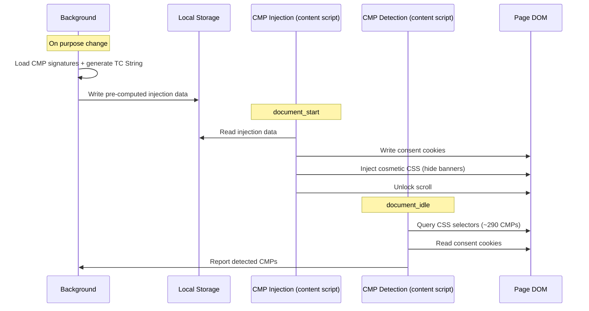

# CMP auto-response

This document is part of the ProtoConsent project and is licensed under the Creative Commons Attribution-ShareAlike 4.0 International (CC BY-SA 4.0) license. See the repository README and the [LICENSE-CC-BY-SA](../../LICENSE-CC-BY-SA) file for details.

## Contents

- [1. Overview](#1-overview)
- [2. Architecture](#2-architecture)
- [3. CMP signatures](#3-cmp-signatures)
- [4. TC String (IAB TCF v2.2)](#4-tc-string-iab-tcf-v22)
- [5. Three-layer response](#5-three-layer-response)
- [6. Domain scoping](#6-domain-scoping)
- [7. User controls](#7-user-controls)
- [8. Limitations](#8-limitations)
- [9. Comparison with other approaches](#9-comparison-with-other-approaches)
- [10. Interaction with TCF detection and banner observation](#10-interaction-with-tcf-detection-and-banner-observation)
- [11. Distribution](#11-distribution)
- [12. Adding a new CMP](#12-adding-a-new-cmp)

## 1. Overview

CMP auto-response is ProtoConsent's mechanism for translating the user's purpose preferences into the consent cookies that consent management platforms (CMPs) read on page load. When a page loads, ProtoConsent injects the appropriate consent cookies *before* any CMP script runs, so the CMP reads those cookies and skips the consent banner entirely. The user's preferences are enforced without interacting with the banner.

This is a declarative approach: ProtoConsent writes the data that the CMP expects to find, and the CMP treats the user as already having responded. No DOM interaction, no click simulation, no waiting for the banner to render.

## 2. Architecture

The system has two components:

**Background service worker**: loads CMP signatures, computes the IAB TCF v2.2 TC String from the user's purpose preferences, and writes everything to local storage so the content script can read it at page load.

**Content script** (runs at `document_start`, before any CMP script): reads signatures and purposes from storage, then executes three layers of response:

1. **Cookie injection** - writes consent cookies using signature templates
2. **Cosmetic CSS** - injects `display:none!important` rules targeting known banner selectors
3. **Scroll unlock** - removes scroll lock (CSS classes or inline styles) that CMPs apply to prevent scrolling until consent is given



## 3. CMP signatures

Signatures are defined in the bundled CMP signatures file (with metadata wrapper). Each entry in the `signatures` object describes how a specific CMP stores and displays consent:

```json
{
  "onetrust": {
    "cookie": [
      {
        "name": "OptanonConsent",
        "template": "...groups=1%3A1%2C2%3A{analytics}%2C3%3A{personalization}%2C4%3A{ads}..."
      },
      {
        "name": "OptanonAlertBoxClosed",
        "template": "{DATE_ISO}"
      }
    ],
    "purposeMap": {
      "analytics": "2",
      "personalization": "3",
      "ads": "4"
    },
    "format": { "allow": "1", "deny": "0" },
    "selector": "#onetrust-banner-sdk, #onetrust-consent-sdk, .onetrust-pc-dark-filter",
    "lockClass": "ot-sdk-show-settings"
  }
}
```

### Fields

| Field | Type | Required | Description |
|-------|------|----------|-------------|
| `cookie` | array | Yes | One or more cookies to inject. Each has `name` and `template`. |
| `cookie[].template` | string | Yes | Cookie value with placeholders: `{analytics}`, `{ads}`, `{personalization}`, `{third_parties}`, `{gpc}`, `{DATE_ISO}`, `{DATESTAMP_ENCODED}`, `{UUID}`, `{TIMESTAMP}`, `{STAMP}`, `{TC_STRING}`. |
| `cookie[].siteSpecific` | boolean | No | If true, cookie requires site-specific data that cannot be templated. Cosmetic-only fallback. |
| `purposeMap` | object | No | Maps ProtoConsent purpose keys to CMP-specific purpose identifiers. Informational. |
| `format` | object | No | `{ "allow": "...", "deny": "..." }` - the string values that replace purpose placeholders. Default: `{ "allow": "1", "deny": "0" }`. |
| `selector` | string\|null | No | CSS selector(s) for the CMP banner and overlay elements. Used by cosmetic CSS layer. |
| `lockClass` | string\|null | No | CSS class the CMP adds to `body` or `html` to prevent scrolling. |
| `domains` | string[] | No | If present, signature only applies to these domains/brands. Matched against the registrable domain and its brand (first label). Signatures without `domains` apply globally. |
| `note` | string | No | Internal documentation about the CMP's behaviour or limitations. |

### Supported CMPs (31)

| CMP | Cookie(s) | Format | Scope |
|-----|-----------|--------|-------|
| OneTrust | `OptanonConsent`, `OptanonAlertBoxClosed` | purpose groups 1-4, 1/0 | Global |
| Cookiebot | `CookieConsent` | necessary/preferences/statistics/marketing, true/false | Global |
| Sourcepoint | `consentUUID` | UUID only | Global |
| Didomi | `didomi_token` | Site-specific (cosmetic fallback) | Global |
| Quantcast | `addtl_consent` | Google AC String | Global |
| TrustArc | `notice_preferences`, `cmapi_cookie_privacy`, `notice_gdpr_pr498` | Minimal consent | Global |
| ConsentManager | `cmpvendorconsent`, `cmpconsent` | Presence-only | Global |
| IAB TCF v2.2 | `euconsent-v2` | Full TC String (generated) | Global |
| Iubenda | `_iub_cs-s` | Presence-only | Global |
| CookieYes | `cookieyes-consent`, `wt_consent`, `cookielawinfo-checkbox-*`, `viewed_cookie_policy` | Per-category yes/no | Global |
| Complianz | `cmplz_functional`, `cmplz_statistics`, `cmplz_marketing`, `cmplz_preferences`, `cmplz_banner-status` | allow/deny per purpose | Global |
| Borlabs | (cosmetic only) | - | Global |
| Termly | (cosmetic only) | - | Global |
| Axeptio | (cosmetic only) | - | Global |
| Osano | `osano_consentmanager` | Presence-only | Global |
| Sirdata | (cosmetic only) | - | Global |
| Civic | (cosmetic only) | - | Global |
| CCM19 | (localStorage observation) | `ccm_consent` categories: analytics/marketing/functional booleans | Global |
| Usercentrics | (localStorage observation) | `uc_settings` services with history actions | Global |
| Amasty | `amcookie_policy_restriction`, `amcookie_allowed` | allowed/-1 | Global |
| Wix | `consent-policy` | URL-encoded JSON with ess/func/anl/adv/dt3 | Global |
| Fides | `fides_consent` | URL-encoded JSON with consent/identity/meta | Global |
| Bing/Microsoft | `BCP` | `AD={ads}&AL={analytics}&SM={personalization}`, 1/0 | bing, microsoft, outlook, live, msn |
| Amazon | (cosmetic only) | Server-side consent (POST) | amazon |
| TikTok | `cookie-consent` | URL-encoded JSON, per-partner booleans | tiktok.com |
| eBay | (cosmetic only) | Server-side consent (POST) | ebay |
| LinkedIn | (cosmetic only) | Server-signed cookie (HMAC) | linkedin.com |
| Twitter/X | `d_prefs` | Base64-encoded static reject value | twitter.com, x.com |
| Reddit | `eu_cookie` | URL-encoded JSON, opted + nonessential | reddit.com |
| Facebook | (cosmetic only) | Server-side consent | facebook.com |
| Yahoo | `EuConsent`, `cmp` | IAB TC String + static cmp cookie | yahoo |

### Signature types

Based on cookie support, signatures fall into three categories:

- **Full cookie injection**: Template produces a valid cookie that the CMP reads and accepts (OneTrust, Cookiebot, CookieYes, Complianz, Wix, Fides, Bing). Banner suppressed at the source.
- **Presence/minimal injection**: Cookie signals "consent given" but lacks full purpose mapping (Sourcepoint, TrustArc, Quantcast, ConsentManager, Osano, Amasty). CMP may still initialize but skips the banner.
- **Cosmetic only**: No injectable cookie and no observable storage format. Banner is hidden via CSS. (Borlabs, Termly, Axeptio, Sirdata, Civic, Didomi).
- **localStorage observation**: CMP stores consent in `localStorage` instead of cookies. A content script running in the page context reads and parses the storage entry, sending a compact summary to the background for decoding and conflict detection. Banner hiding via CSS selectors. (Usercentrics via `uc_settings`, CCM19 via `ccm_consent`).

## 4. TC String (IAB TCF v2.2)

For CMPs that read the `euconsent-v2` cookie (the IAB Transparency and Consent Framework standard), ProtoConsent generates a valid TC String.

### Purpose mapping

| ProtoConsent purpose | TCF purpose IDs | TCF purpose names |
|---------------------|-----------------|-------------------|
| functional | 1 | Store and/or access information on a device |
| ads | 2, 3, 4, 7 | Basic ads, Create ads profile, Show personalized ads, Measure ad performance |
| analytics | 8, 9 | Measure content performance, Apply market research |
| personalization | 5, 6 | Create content profile, Show personalized content |

TCF purpose 10 (Develop and improve products) is not mapped and defaults to denied (0).

### Legitimate Interest transparency

TCF v2.2 restricts purposes 3-6 from using legitimate interest as a legal basis. The TC String sets LI transparency bits only for purposes that:
- Are denied by the user, AND
- Are not in the LI-forbidden set (3, 4, 5, 6)

### Structure

The TC String consists of two segments separated by `.`:

1. **Core segment** (213+ bits): version, timestamps, CMP metadata, 24 purpose consent bits, 24 LI transparency bits, publisher country, vendor consent (empty), vendor LI (empty), publisher restrictions (none).
2. **Disclosed Vendors segment** (type 1): empty (no specific vendors disclosed).

Fixed values:
- `CmpId = 1` (placeholder - ProtoConsent has no registered IAB CMP ID)
- `CmpVersion = 1`
- `VendorListVersion = 1`
- `TcfPolicyVersion = 4` (TCF v2.2)
- `IsServiceSpecific = true`
- `ConsentLanguage = EN`

### Encoding

Bits are packed manually (no dependencies) and encoded to base64url using the TCF alphabet (`A-Za-z0-9-_`). No external libraries.

## 5. Three-layer response

### Layer 1: Cookie injection

For each applicable signature, the content script:
1. Resolves template placeholders with user purposes (`{analytics}` -> `"1"` or `"0"`)
2. Replaces utility placeholders (`{DATE_ISO}`, `{UUID}`, `{TIMESTAMP}`, `{TC_STRING}`)
3. Sanitizes the value (strips semicolons to prevent cookie attribute injection)
4. Writes the cookie with `path=/; domain=.{registrable}; SameSite=Lax; max-age={maxAge}`

A fresh random UUID is generated for each page visit via `crypto.randomUUID()`, so consent cookies contain a unique, unlinkable identifier every time. Sites cannot correlate visits through this field. If the user sets a fixed UUID in Purpose Settings, that value is used instead.

**Cookie cleanup**: Injected cookies are deleted after 5 seconds. CMPs read their cookies synchronously during script initialization (first 1-2 seconds). Deleting the cookies afterwards reduces HTTP overhead on subsequent same-domain requests (images, XHR, lazy loads). Cookies are re-injected on the next page navigation.

### Layer 2: Cosmetic CSS

All applicable `selector` values are joined and injected as a `<style data-pc-cmp>` element:

```css
#onetrust-banner-sdk, .qc-cmp2-container, ... { display: none !important }
```

This is a safety net for cases where cookie injection is late or incomplete.

### Layer 3: Scroll unlock

CMPs typically lock page scrolling while the banner is visible, using either:
- A CSS class on `body` or `html` (e.g., `ot-sdk-show-settings`, `fides-no-scroll`)
- Inline styles (`overflow: hidden`, `position: fixed`)

The content script:
1. Injects CSS rules targeting known lock classes
2. Applies inline `!important` overrides for `overflow` and `position` when lock patterns are detected
3. Watches for CMP re-locking attempts via `MutationObserver` for 10 seconds

A `MutationObserver` detects dynamically injected banners (CMPs that load after page start) with a safety timeout of 15 seconds.

## 6. Domain scoping

Signatures can be scoped to specific domains via the `domains` field. The content script extracts the registrable domain and brand from `location.hostname`:

```
location.hostname = "www.bing.com"
registrable domain = "bing.com"
brand = "bing"
```

A signature matches if any entry in `domains` equals the registrable domain OR the brand. This allows `"domains": ["bing", "microsoft"]` to match `bing.com`, `bing.co.uk`, `microsoft.com`, etc.

Signatures without `domains` apply to all sites (standard CMPs like OneTrust, Cookiebot, etc.).

## 7. User controls

CMP auto-response is configured from Purpose Settings:

- **Master toggle**: enables or disables all CMP injection globally (on by default).
- **Per-CMP toggles**: disable specific CMPs individually (e.g., turn off OneTrust injection while keeping others active).
- **Cookie expiration**: configurable max-age for injected cookies (default: 90 days).
- **Custom UUID**: optional fixed UUID for consent cookies. When empty (default), a unique random UUID is generated per page visit so sites cannot correlate visits through this field.

For testing instructions, see [testing-guide.md, section 16](../testing-guide.md#16-testing-cmp-auto-response).

## 8. Limitations

### 8.1 Current limitations

- **No click simulation**: ProtoConsent does not simulate clicks on banner buttons. This is a deliberate design choice -- the extension declares consent via data, not interaction.
- **CMP-specific cookies**: Some CMPs (like Didomi) use site-specific tokens that cannot be templated. These fall back to cosmetic hiding.
- **Proprietary consent systems**: Sites with fully custom consent systems (not using any standard CMP) are not covered. The signature approach targets widely-deployed CMP frameworks.
- **TC String vendor sections**: The generated TC String has empty vendor consent and disclosed vendor sections. CMPs that check for specific vendor IDs may not fully accept it, though in practice CMPs read the purpose bits.
- **localStorage observation is read-only**: the page context script reads localStorage entries but does not write to them. It observes what the CMP stored, compares against user preferences, and reports conflicts. It cannot pre-empt localStorage-based CMPs the way cookie injection pre-empts cookie-based CMPs.

### 8.2 Page context integration

A content script running in the page's JavaScript context (registered at `document_idle`) provides read access to CMP APIs. This enables:

- **TCF detection**: reads the CMP's own consent status via the standard `__tcfapi` API. Reported in the popup as a TCF pill.
- **GPP detection**: detects the Global Privacy Platform API (`__gpp`).
- **localStorage observation**: reads localStorage entries for CMPs that store consent there (Usercentrics, CCM19). Parses data in the page context and sends a compact summary to the background for conflict detection.

Security hardening: native JavaScript references are captured at script start before page code can override them. All data from localStorage is sanitized with type checks, field whitelisting, and size limits before being sent to the extension.

The page context script is read-only and observational. It does not write to localStorage, inject `__tcfapi`, or modify page state.

### 8.3 CMPs not supported by cookie injection

The following CMPs use server-side consent mechanisms that cannot be replicated by client-side cookie injection. ProtoConsent falls back to cosmetic hiding (banner hidden via CSS) on these sites.

**Server-signed cookies:** Google, LinkedIn

**Server-side consent (POST):** Amazon, eBay, Facebook

**Server-side redirect wall:** Yahoo

**Site-specific tokens:** Didomi, Sourcepoint, Borlabs

**localStorage-only (no injectable cookie):** Usercentrics, CCM19

**Consent walls (pay-or-consent):** Sites that tie consent to a paywall (e.g., some news outlets). ProtoConsent does not circumvent access controls by design.

## 9. Comparison with other approaches

| | ProtoConsent | Click-based extensions | Content blockers (uBlock, etc.) |
|---|---|---|---|
| **Mechanism** | Cookie injection before CMP loads | DOM interaction (simulate clicks on banner buttons) | Block CMP script entirely |
| **Timing** | Before CMP loads (preventive) | After banner renders (reactive) | Before CMP loads (preventive) |
| **Banner appears** | No (cookie pre-empts it) | Briefly (until click fires) | No (script blocked) |
| **CMP reads preferences** | Yes (from injected cookie) | Yes (via its own UI flow) | No (CMP never loads) |
| **`__tcfapi` available** | Read-only (MAIN world observes it) | Yes (CMP creates it) | No (CMP blocked) |
| **Purpose-level control** | Yes (per-purpose consent values) | Varies (most are all-or-nothing) | No (binary block/allow) |
| **Maintenance model** | Signature JSON per CMP | CSS selectors + click targets per CMP | Filter lists (domain-based) |
| **Breakage risk** | Low (CMP sees valid consent) | Medium (DOM changes break selectors) | High (consent wall, `__tcfapi` undefined) |
| **Dark pattern risk** | None (no interaction to misinterpret) | A failed or partial click can be treated by the CMP as implicit consent | None (CMP never loads) |

## 10. Interaction with TCF detection and banner observation

CMP auto-response and CMP observation are complementary systems:

- **Auto-response** (content script, `document_start`): injects consent cookies before any CMP script loads. Preventive.
- **Banner detection** (content script, `document_idle`): detects CMP presence via CSS selectors (~290 CMPs). Reports `[banner]` lines in the Log tab. Includes a delayed recheck for async-loaded CMPs.
- **Cookie observation** (delayed after page load): reads CMP cookies by name from the signature list. The background decodes cookie values (OneTrust, Cookiebot, CookieYes, Complianz, Wix) and compares against user purposes. Reports `[banner-consent]` lines showing conflicts or matches.
- **localStorage observation** (page context, `document_idle`): reads localStorage entries for CMPs that store consent there (Usercentrics, CCM19). The background decodes the data and compares against user purposes. Reports `[banner-consent]` lines.
- **TCF/GPP detection** (page context): calls `__tcfapi` and `__gpp` APIs. The TCF pill in the popup shows the site's own consent status as reported by its CMP.

The `[banner]` and `[banner-consent]` tags in the Log distinguish detection (CSS presence) from observation (consent state comparison). Both are persisted per tab across service worker restarts.

## 11. Distribution

CMP signatures are bundled with the extension for first-install availability and updated via CDN when the user enables list sync. They are integrated into the Enhanced Protection system as a list type alongside blocking, cosmetic, and informational lists. The UI shows them as **ProtoConsent Banners** in the Protection tab.

For the full CDN distribution model and automated refresh workflow, see [list-catalog.md, section 9](list-catalog.md#9-cmp-auto-response-signatures).

## 12. Adding a new CMP

To add support for a new consent management platform:

### 1. Research the CMP

Identify:
- **Cookie name(s)** the CMP reads at initialization. Inspect the site's cookies before/after accepting consent. Note the format (JSON, URL-encoded, delimited groups, presence-only).
- **Purpose mapping**: how the CMP maps purpose consent to cookie values. Match to ProtoConsent's 6 purposes (functional, analytics, ads, personalization, third_parties, advanced_tracking).
- **Allow/deny format**: what values represent consent granted vs denied (`1`/`0`, `true`/`false`, `allow`/`deny`, etc.).
- **Banner selector(s)**: CSS selectors for the banner container and overlay elements. Use browser DevTools to identify stable selectors (IDs are best, classes with CMP-specific prefixes are acceptable).
- **Scroll lock**: check if the CMP adds a CSS class to `body`/`html` or sets inline `overflow: hidden` when the banner is shown.
- **Domain scope**: is this a standard CMP used across many sites (global), or specific to a domain/brand?

### 2. Create the signature entry

Add a JSON entry to the bundled CMP signatures file in the extension and to the enhanced version in the data repo. See [section 3](#3-cmp-signatures) for the full field reference.

Minimal entry (cosmetic only, no injectable cookie):
```json
"my_cmp": {
  "selector": "#my-cmp-banner, .my-cmp-overlay",
  "lockClass": "my-cmp-no-scroll"
}
```

Full entry (cookie injection):
```json
"my_cmp": {
  "cookie": [
    {
      "name": "my_cmp_consent",
      "template": "analytics={analytics}&ads={ads}&personalization={personalization}"
    }
  ],
  "format": { "allow": "1", "deny": "0" },
  "purposeMap": { "analytics": "analytics", "ads": "ads", "personalization": "personalization" },
  "selector": "#my-cmp-banner",
  "lockClass": null
}
```

### 3. Update counts

- Update `cmp_count` in both signature files (bundled and enhanced).
- Update the catalog generator in the data repo if the count is hardcoded.

### 4. Test

See [testing-guide.md, section 16](../testing-guide.md#16-testing-cmp-auto-response) for testing instructions. Key checks:
- Visit a site using the CMP. Verify the banner does not appear.
- Check the Log tab Requests stream for a `[banner]` line showing the CMP ID and detection state.
- Check Purpose Settings to verify the new CMP appears in the list.
- If cookie injection: inspect cookies to verify the correct values were set and cleaned up after 5 seconds.
- If cosmetic only: verify the banner is hidden via CSS (check for `<style data-pc-cmp>` in the page head).

### 5. No code changes needed

The UI and background automatically handle any entries in the signatures file. No extension code changes are required to add a new CMP - only the JSON signature files need updating.
