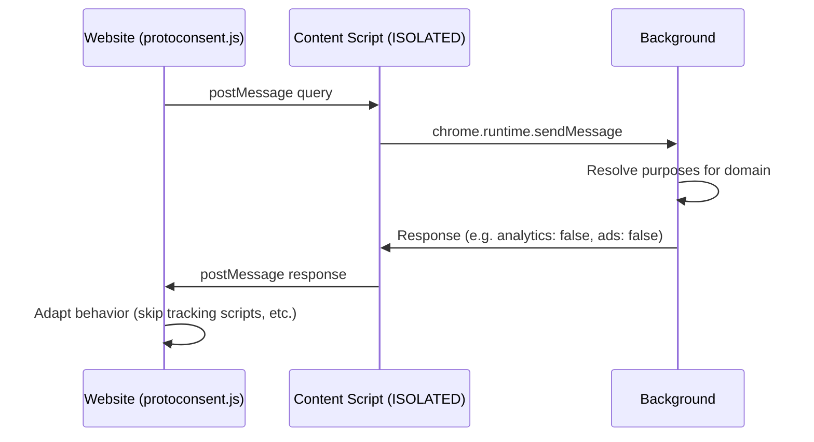

# ProtoConsent Signalling Protocol (Draft)

This document is part of the ProtoConsent project and is licensed under the Creative Commons Attribution-ShareAlike 4.0 International (CC BY-SA 4.0) license. See the repository README and the [LICENSE-CC-BY-SA](../../LICENSE-CC-BY-SA) file for details.

## 1. Overview

This document specifies the signalling protocol between web pages and the ProtoConsent browser extension. It defines how a page-side SDK can query the user's consent preferences via browser messaging primitives.

The protocol is entirely local: communication happens between a page-side SDK and the extension via a content script bridge. There is no central server. It covers two layers:

- **Communication model**: SDK <-> extension messaging via a content script bridge (section 2-3).
- **Site declaration**: a static `.well-known/protoconsent.json` file for voluntary purpose disclosure (section 4).

The data model (purposes, profiles, per-domain rules) is defined in [data-model.md](data-model.md). A separate inter-extension protocol allows other browser extensions to query the user's consent state; see [inter-extension-protocol.md](inter-extension-protocol.md).

**Status:** draft.

## Contents

- [ProtoConsent Signalling Protocol (Draft)](#protoconsent-signalling-protocol-draft)
  - [1. Overview](#1-overview)
  - [Contents](#contents)
  - [2. Communication Model](#2-communication-model)
    - [2.1 Architecture](#21-architecture)
    - [2.2 Message format (informative, subject to change)](#22-message-format-informative-subject-to-change)
    - [2.3 No network communication](#23-no-network-communication)
  - [3. SDK API Surface](#3-sdk-api-surface)
    - [Quick example](#quick-example)
  - [4. Site Declaration (`.well-known/protoconsent.json`)](#4-site-declaration-well-knownprotoconsentjson)

## 2. Communication Model

### 2.1 Architecture



- The **SDK** runs in the page's JavaScript context and cannot access extension APIs directly.
- A **content script** injected by the extension acts as the bridge. It receives `postMessage` queries from the page and forwards them to the **background script** via `chrome.runtime.sendMessage`.
- The **background script** resolves the query against stored rules and the active profile, and returns the result through the same chain.
- Communication uses `window.postMessage` with structured messages identified by type prefix.

### 2.2 Message format (informative, subject to change)

**Query** (page -> extension):

```json
{
  "type": "PROTOCONSENT_QUERY",
  "id": "uuid-string",
  "action": "get | getAll | getProfile",
  "purpose": "analytics"
}
```

**Response** (extension -> page):

```json
{
  "type": "PROTOCONSENT_RESPONSE",
  "id": "uuid-string",
  "data": true
}
```

The `id` field correlates requests with responses. The `purpose` field is only present for `get` actions. The `data` field contains: `boolean|null` for `get`, `object|null` for `getAll`, `string|null` for `getProfile`.

### 2.3 No network communication

The protocol is entirely local. No HTTP requests, no server endpoints, no remote API. All data stays within the browser.

## 3. SDK API Surface

The SDK exposes a minimal read-only API for web pages:

| Member | Type | Returns |
| --- | --- | --- |
| `ProtoConsent.get(purpose)` | method | `Promise<boolean\|null>`: `true` = allowed, `false` = denied, `null` = extension not present |
| `ProtoConsent.getAll()` | method | `Promise<object\|null>`: all purpose states, or `null` |
| `ProtoConsent.getProfile()` | method | `Promise<string\|null>`: `"strict"`, `"balanced"`, `"permissive"`, or `null` |
| `ProtoConsent.version` | property | `string`: SDK version |
| `ProtoConsent.purposes` | property | `string[]`: the valid purpose keys |

### Quick example

```html
<script type="module">
  import ProtoConsent from 'protoconsent.js';

  // Check a single purpose: returns true, false, or null (no extension)
  const allowed = await ProtoConsent.get('analytics');
  if (allowed) {
    // user allows analytics on this site
  }

  // Read all purposes at once
  const all = await ProtoConsent.getAll();
  // -> { functional: true, analytics: false, ads: false, personalization: false,
  //     third_parties: false, advanced_tracking: false }

  // Read the active profile
  const profile = await ProtoConsent.getProfile();
  // -> "strict", "balanced", "permissive", or null
</script>
```

Every method returns a `Promise` that resolves to `null` when the extension is not installed: no errors, no retries, no side effects.

## 4. Site Declaration (`.well-known/protoconsent.json`)

Websites can optionally declare their data-processing purposes by serving a static JSON file at `/.well-known/protoconsent.json`. This is a **voluntary, informational declaration**: it does not change how the extension enforces user preferences.

The SDK enables **dynamic interaction** (page queries extension via JavaScript). The `.well-known` file enables **static declaration** (extension reads site metadata). A site can use one, both, or neither.

Full specification: [protoconsent-well-known.md](protoconsent-well-known.md)
