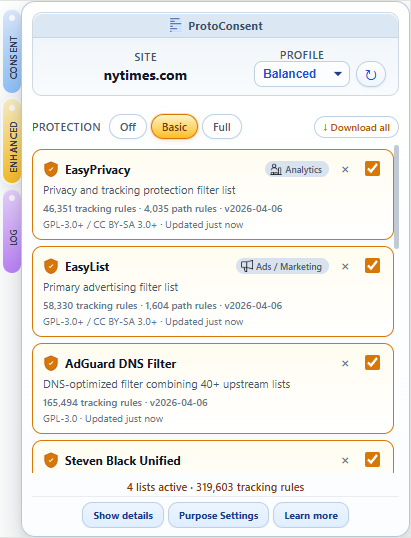
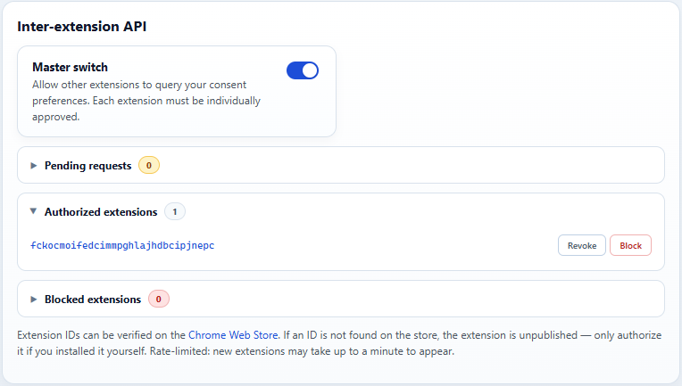

# ProtoConsent: How to test the extension

This document is part of the ProtoConsent project and is licensed under the Creative Commons Attribution-ShareAlike 4.0 International (CC BY-SA 4.0) license. See the repository README and the [LICENSE-CC-BY-SA](../LICENSE-CC-BY-SA) file for details.

## Contents

- [ProtoConsent: How to test the extension](#protoconsent-how-to-test-the-extension)
  - [Contents](#contents)
  - [1. Requirements](#1-requirements)
  - [2. Installing the Extension (Developer Mode)](#2-installing-the-extension-developer-mode)
  - [3. Basic Test: Per‑Site Profile](#3-basic-test-persite-profile)
  - [4. Purpose Toggles and Visible Effects](#4-purpose-toggles-and-visible-effects)
  - [5. Example: Blocking Ads on elpais.com (DoubleClick)](#5-example-blocking-ads-on-elpaiscom-doubleclick)
    - [5.1 Baseline: Ads Allowed](#51-baseline-ads-allowed)
    - [5.2 Ads Blocked with ProtoConsent](#52-ads-blocked-with-protoconsent)
  - [6. Trying different sites, profiles and purposes](#6-trying-different-sites-profiles-and-purposes)
    - [6.1 Functional (service)](#61-functional-service)
    - [6.2 Analytics](#62-analytics)
    - [6.3 Ads / Marketing](#63-ads--marketing)
    - [6.4 Personalization / Profiling](#64-personalization--profiling)
    - [6.5 Third-party sharing](#65-third-party-sharing)
    - [6.6 Advanced tracking / fingerprinting](#66-advanced-tracking--fingerprinting)
  - [7. Testing the SDK query flow (content script bridge)](#7-testing-the-sdk-query-flow-content-script-bridge)
    - [7.1 Setup](#71-setup)
    - [7.2 Querying from the browser console](#72-querying-from-the-browser-console)
    - [7.3 Expected results](#73-expected-results)
    - [7.4 Security validation](#74-security-validation)
  - [8. Testing Global Privacy Control (Sec-GPC header)](#8-testing-global-privacy-control-sec-gpc-header)
    - [8.1 GPC active (default with Balanced or Strict)](#81-gpc-active-default-with-balanced-or-strict)
    - [8.2 GPC inactive (all privacy purposes allowed)](#82-gpc-inactive-all-privacy-purposes-allowed)
    - [8.3 GPC globally disabled](#83-gpc-globally-disabled)
    - [8.4 Verifying rules from the service worker console](#84-verifying-rules-from-the-service-worker-console)
    - [8.5 Client Hints stripping (high-entropy Sec-CH-UA-\* headers)](#85-client-hints-stripping-high-entropy-sec-ch-ua--headers)
  - [9. Enabling the debug panel](#9-enabling-the-debug-panel)
    - [9.1 Activate debug mode](#91-activate-debug-mode)
    - [9.2 Deactivate debug mode](#92-deactivate-debug-mode)
  - [10. Testing site declarations (`.well-known/protoconsent.json`)](#10-testing-site-declarations-well-knownprotoconsentjson)
    - [10.1 Using demo.protoconsent.org](#101-using-demoprotoconsentorg)
    - [10.2 What to check](#102-what-to-check)
    - [10.3 Publishing your own declaration](#103-publishing-your-own-declaration)
  - [11. Switching to DNR debug mode](#11-switching-to-dnr-debug-mode)
    - [11.1 When to use it](#111-when-to-use-it)
    - [11.2 Activating DNR debug mode](#112-activating-dnr-debug-mode)
    - [11.3 What changes](#113-what-changes)
    - [11.4 Deactivating DNR debug mode](#114-deactivating-dnr-debug-mode)
  - [12. Testing the domain whitelist](#12-testing-the-domain-whitelist)
    - [12.1 Allowing a blocked domain](#121-allowing-a-blocked-domain)
    - [12.2 Removing a whitelisted domain](#122-removing-a-whitelisted-domain)
    - [12.3 Per‑site vs global scope](#123-persite-vs-global-scope)
    - [12.4 Verifying whitelist rules from the service worker console](#124-verifying-whitelist-rules-from-the-service-worker-console)
  - [13. Testing Enhanced Protection](#13-testing-enhanced-protection)
    - [13.1 Activating a preset](#131-activating-a-preset)
    - [13.2 Downloading and toggling lists](#132-downloading-and-toggling-lists)
    - [13.3 Verifying enhanced blocks in the Log tab](#133-verifying-enhanced-blocks-in-the-log-tab)
    - [13.4 Checking enhanced rules from the service worker console](#134-checking-enhanced-rules-from-the-service-worker-console)
    - [13.5 CNAME cloaking detection (informational)](#135-cname-cloaking-detection-informational)
    - [13.6 Cosmetic filtering (element hiding)](#136-cosmetic-filtering-element-hiding)
    - [13.7 Enhanced lists consent gate (sync)](#137-enhanced-lists-consent-gate-sync)
    - [13.8 Consent-enhanced link](#138-consent-enhanced-link)
    - [13.9 ProtoConsent Core lists](#139-protoconsent-core-lists)
    - [13.10 Regional filter lists](#1310-regional-filter-lists)
  - [14. Testing the inter-extension API](#14-testing-the-inter-extension-api)
    - [14.1 Enabling the API](#141-enabling-the-api)
    - [14.2 Sending a test query](#142-sending-a-test-query)
    - [14.3 Authorizing a consumer extension](#143-authorizing-a-consumer-extension)
    - [14.4 Blocking and unblocking](#144-blocking-and-unblocking)
    - [14.5 Rate limiting](#145-rate-limiting)
    - [14.6 Observability in the Log tab](#146-observability-in-the-log-tab)
    - [14.7 Disabling the API](#147-disabling-the-api)
    - [14.8 Verifying inter-extension state from the service worker console](#148-verifying-inter-extension-state-from-the-service-worker-console)
  - [15. Testing import/export configuration](#15-testing-importexport-configuration)
    - [15.1 Exporting configuration](#151-exporting-configuration)
    - [15.2 Importing configuration](#152-importing-configuration)
    - [15.3 Partial imports and validation](#153-partial-imports-and-validation)
  - [16. Testing CMP auto-response](#16-testing-cmp-auto-response)
    - [16.1 Verifying banner suppression](#161-verifying-banner-suppression)
    - [16.2 Checking injected cookies](#162-checking-injected-cookies)
    - [16.3 Verifying cookie cleanup](#163-verifying-cookie-cleanup)
    - [16.4 Cosmetic CSS and scroll unlock](#164-cosmetic-css-and-scroll-unlock)
    - [16.5 Domain-scoped signatures (Bing/Microsoft)](#165-domain-scoped-signatures-bingmicrosoft)
    - [16.6 Verifying CMP injection data from the service worker console](#166-verifying-cmp-injection-data-from-the-service-worker-console)
    - [16.7 Verifying CMP observability in the Log and Debug tabs](#167-verifying-cmp-observability-in-the-log-and-debug-tabs)
      - [Log tab - Requests stream](#log-tab---requests-stream)
      - [Debug panel - CMP sections](#debug-panel---cmp-sections)
      - [Session persistence](#session-persistence)
  - [17. Testing the Overview tab](#17-testing-the-overview-tab)
    - [17.1 Viewing signal indicators](#171-viewing-signal-indicators)
    - [17.2 Purpose accordion cards](#172-purpose-accordion-cards)
    - [17.3 CMP detection and auto-response cards](#173-cmp-detection-and-auto-response-cards)
    - [17.4 Auto-refresh behaviour](#174-auto-refresh-behaviour)
  - [18. Testing URL parameter stripping](#18-testing-url-parameter-stripping)
    - [18.1 Verifying param strip detection](#181-verifying-param-strip-detection)
    - [18.2 Overview tab - Param Stripping accordion](#182-overview-tab---param-stripping-accordion)
    - [18.3 Log tab - Param strip events](#183-log-tab---param-strip-events)
    - [18.4 Session persistence](#184-session-persistence)
    - [18.5 Verifying param strip state from the service worker console](#185-verifying-param-strip-state-from-the-service-worker-console)
  - [19. Testing operating mode switching](#19-testing-operating-mode-switching)
    - [19.1 Switching to Monitoring mode](#191-switching-to-monitoring-mode)
    - [19.2 Verifying monitoring behaviour](#192-verifying-monitoring-behaviour)
    - [19.3 Switching back to Blocking](#193-switching-back-to-blocking)
    - [19.4 Verifying mode persistence](#194-verifying-mode-persistence)
    - [19.5 Import/export with operating mode](#195-importexport-with-operating-mode)

## 1. Requirements

- **A Chromium‑based browser** (for example, Chrome, Edge or Brave)
- **Ability to load an unpacked extension** in developer mode
- **A few test sites** that use common analytics or ads/advertising services (for example, news sites)

## 2. Installing the Extension (Developer Mode)

2.1. **Clone the ProtoConsent repository locally:**

  ```bash
  git clone https://github.com/ProtoConsent/ProtoConsent.git
  cd ProtoConsent
  ```

  In this folder you should see the `extension/` directory, which contains the extension files (`manifest.json`, `background.js`, etc.), and the `sdk/` directory, which contains the SDK.

2.2. **Load the extension in your browser:**

- Open the extensions page (for example `chrome://extensions/` or `edge://extensions/`).
- Enable **Developer mode**.
- Click **Load unpacked** and select the `extension/` folder inside the cloned repository (the one that contains `manifest.json`).
- Confirm that an extension called **ProtoConsent** appears in the extensions list and that it is enabled. Pin it in the toolbar if your browser supports pinning.

## 3. Basic Test: Per‑Site Profile

Verify that site rules are stored per domain and correctly associated with each site.

1. Visit any news or blog site of your choice.
2. Open the ProtoConsent popup from the browser toolbar.
3. Use the **Profile** selector to assign a profile to the current site (for example, “Strict” or “Balanced”).
4. Reload the page.
5. Open the popup again and confirm that the selected profile is still applied to this site.
6. If you repeat the same steps on a different domain, each site should keep its own profile.

Example popup view with profile and per‑purpose summary:


Expanded view with purpose toggles visible:


## 4. Purpose Toggles and Visible Effects

Changing purposes in ProtoConsent has direct, observable effects on network traffic.

1. On a site that uses web analytics, open the ProtoConsent popup.
2. Choose a profile (for example “Balanced”).
3. In the popup, make sure that **Functional (service)** remains **Allowed** and set **Analytics** to **Blocked** for this site.
4. Open your browser’s developer tools and go to the **Network** tab. Optionally filter by a common analytics domain (for example `google-analytics.com` or `analytics`).
5. Reload the page and observe the network requests. You should see that analytics requests that would normally be sent are now missing or reported as blocked.
6. Switch to a more permissive profile or enable **Analytics** for this site in the popup.
7. Reload again and confirm that analytics requests are now visible in the network log.

The point is to see the cause and effect: toggle a purpose, watch requests appear or disappear.

## 5. Example: Blocking Ads on elpais.com (DoubleClick)

This example uses the Spanish news site <https://elpais.com/> to demonstrate how the **Ads / Marketing** purpose affects third‑party ad requests.

### 5.1 Baseline: Ads Allowed

1. Open <https://elpais.com/> in a new tab.
2. Open the ProtoConsent popup.
3. Ensure the **Profile** is set to a mode where **Ads / Marketing** is **Allowed** for elpais.com.
4. Open developer tools and go to the **Network** tab.
5. Use the filter box to search for `doubleclick` or `googlesyndication`.
6. Reload the page.
7. In the Network panel you should see requests to domains like `g.doubleclick.net`, `googleads.g.doubleclick.net` or `pagead2.googlesyndication.com` with status 200 (or similar).

### 5.2 Ads Blocked with ProtoConsent

1. With the same elpais.com tab open, switch back to the ProtoConsent popup.
2. Set **Ads / Marketing** to **Blocked** for elpais.com.
3. The extension updates its rules immediately.
4. Keep developer tools open on the Network tab, still filtered by `doubleclick`.
5. Reload the page.
6. Now you should see that some requests to `g.doubleclick.net`, `googleads.g.doubleclick.net` or `cm.g.doubleclick.net` fail with `net::ERR_BLOCKED_BY_CLIENT` or similar errors, indicating that the browser blocked them before they were completed.

Example screenshot with ads blocked:


Blocking of tracking resources for the **Ads** purpose on a news site. Notice the missing ad slots in the page header and the `ERR_BLOCKED_BY_CLIENT` entries in the Network panel.

## 6. Trying different sites, profiles and purposes

To explore the ProtoConsent extension, you can combine site profiles with purpose-level tests.

- Repeat the tests above on several sites (for example, other news sites, blogs, or services that embed third‑party widgets).
- Try different profiles (“Strict”, “Balanced”, “Permissive”) to see how they translate into purpose states for each site.
- Experiment with per‑site overrides: start from a profile and then enable or disable a specific purpose manually.

Below are example scenarios for each purpose.

### 6.1 Functional (service)

Functional is a reference-only purpose in this version.

- It represents everything strictly necessary to provide the service (login, navigation, basic UX, billing, support).
- In this early version, Functional does not generate any blocking rules, even if you turn it off, to avoid breaking sites.
- It serves to distinguish “core service” from optional analytics, ads or third‑party integrations.

### 6.2 Analytics

**Analytics controls measurement and usage tracking.**

- Reference domains (examples - full list in `extension/rules/protoconsent_*.json`): `google-analytics.com`, `scorecardresearch.com`, `chartbeat.com`, `fullstory.com`.

- Steps:
  1. Visit a site that uses Google Analytics or Segment.
  2. In the ProtoConsent popup, keep **Functional** allowed and set **Analytics** to *Blocked* for this site.
  3. Open DevTools → **Network**, filter by `google-analytics` or `segment`.
  4. Reload the page and verify that these requests are missing or reported as `ERR_BLOCKED_BY_CLIENT`.
  5. Switch **Analytics** back to *Allowed*, reload and confirm that the requests reappear with status 200.

### 6.3 Ads / Marketing

**Ads / Marketing controls advertising traffic.**

- Reference domains (examples - full list in `extension/rules/protoconsent_*.json`): `doubleclick.net`, `googlesyndication.com`, `adservice.google.com`, `criteo.com`, `taboola.com`.

- Steps:
  1. Use a site with visible ads (for example, a major news site).
  2. With **Ads / Marketing** set to *Allowed*, open **Network** and filter by `doubleclick` or `googlesyndication`. Confirm that requests return 200.
  3. Set **Ads / Marketing** to *Blocked* for this site.
  4. Reload and check that the same requests now disappear or are shown as blocked (for example `ERR_BLOCKED_BY_CLIENT`).

### 6.4 Personalization / Profiling

**Personalization separates basic ads from advanced profiling and retargeting.**

- Reference domains (examples - full list in `extension/rules/protoconsent_*.json`): `bluekai.com`, `crwdcntrl.net`, `acxiom.com`, `barilliance.com`, `audigent.com`.

- Steps:
  1. On a site with banners and personalised or retargeted ads, keep **Ads / Marketing** allowed but set **Personalization / Profiling** to *Blocked*.
  2. Filter in **Network** by `bluekai`, `crwdcntrl`, `audigent`.
  3. Reload and compare the results with the case where Personalization is also allowed.
  4. Results vary by site, but ProtoConsent treats personalization as a separate purpose from “basic ads”.

### 6.5 Third-party sharing

**Third-party sharing covers external data sharing and integrations.**

- Reference domains (examples - full list in `extension/rules/protoconsent_*.json`): `connect.facebook.net`, `addthis.com`, `addtoany.com`, `intercom.io`, `disqus.com`.

- Steps:
  1. Choose a site that embeds social widgets, Hotjar or Microsoft/Bing tracking.

  2. Allow **Functional** and **Analytics**, but set **Third‑party sharing** to *Blocked*.
  3. Filter by `facebook.net`, `addthis`, `intercom` or `disqus` in **Network**.
  4. Reload and compare the results with the case where Third‑party sharing is also allowed.

### 6.6 Advanced tracking / fingerprinting

**Advanced tracking targets monitoring, experimentation and fingerprinting tools.**

- Reference domains (examples - full list in `extension/rules/protoconsent_*.json`): `js-agent.newrelic.com`, `cdn.optimizely.com`, `fpnpmcdn.net`, `datadome.co`, `arkoselabs.com`.

- Steps:
  1. Visit a site that uses New Relic, Heap, Optimizely or similar tooling.
  2. Set **Advanced tracking / fingerprinting** to *Blocked* and keep the other purposes allowed.
  3. Filter in **Network** by `newrelic`, `nr-data`, `heapanalytics` or `optimizely`.
  4. Reload and check whether those requests are blocked; then switch Advanced tracking back to *Allowed* and confirm that they return to 200 responses.

These scenarios are not meant to be exhaustive.

## 7. Testing the SDK query flow (content script bridge)

The SDK lets web pages query consent preferences through a content script bridge. The extension injects a content script on every page that bridges SDK queries to the extension's storage.

### 7.1 Setup

1. Make sure the extension is loaded and reloaded after any code changes (see section 2).
2. Open any website (for example `wikipedia.org`).
3. Use the ProtoConsent popup to set a profile and adjust purposes for this site.

### 7.2 Querying from the browser console

Open DevTools (F12) and go to the **Console** tab. Paste the following helper function:

```js
function testQuery(action, purpose) {
  const id = crypto.randomUUID();
  return new Promise((resolve) => {
    const timer = setTimeout(() => resolve('TIMEOUT'), 600);
    window.addEventListener('message', function handler(event) {
      if (event.data && event.data.type === 'PROTOCONSENT_RESPONSE' && event.data.id === id) {
        clearTimeout(timer);
        window.removeEventListener('message', handler);
        resolve(event.data.data);
      }
    });
    window.postMessage({ type: 'PROTOCONSENT_QUERY', id, action, purpose }, window.location.origin);
  });
}
```

Then run these queries one at a time:

```js
await testQuery('get', 'analytics')
```

You can replace `'analytics'` with any valid purpose key: `functional`, `analytics`, `ads`, `personalization`, `third_parties`, `advanced_tracking`.

```js
await testQuery('getAll')
```

```js
await testQuery('getProfile')
```

### 7.3 Expected results

- `get('analytics')` returns `true` or `false` depending on the purpose state for this site.
- `getAll()` returns an object with a boolean property per purpose, resolved from the active profile plus any overrides.
- `getProfile()` returns the profile name (`"strict"`, `"balanced"` or `"permissive"`).

On a site with no explicit configuration, the results reflect the default profile (currently balanced).

### 7.4 Security validation

These queries should be rejected by the content script:

```js
await testQuery('delete', null)
```

Expected: `TIMEOUT` (invalid action, ignored by the content script).

```js
await testQuery('get', 'malware')
```

Expected: `null` (invalid purpose, the extension has no data for it).

## 8. Testing Global Privacy Control (Sec-GPC header)

ProtoConsent conditionally sends a `Sec-GPC: 1` HTTP request header when privacy-relevant purposes are denied for a site. The purposes that trigger GPC are marked with `triggers_gpc: true` in `extension/config/purposes.json` (currently: ads, third_parties, advanced_tracking).

### 8.1 GPC active (default with Balanced or Strict)

1. Open a site (for example `elpais.com`) with the default Balanced profile.
2. Open DevTools → **Network**, reload the page.
3. Click the first request (the HTML document).
4. In **Request Headers**, look for `Sec-GPC: 1`. It should be present because Balanced denies ads, third_parties and advanced_tracking.

GPC signal detected on a site with privacy purposes denied:


### 8.2 GPC inactive (all privacy purposes allowed)

1. In the ProtoConsent popup, set the site to a custom profile with all purposes allowed.
2. Reload the page.
3. Check **Request Headers** again. `Sec-GPC` should **not** appear.

### 8.3 GPC globally disabled

1. Open Purpose Settings and uncheck the GPC toggle.
2. Reload a site that previously showed `Sec-GPC: 1` (e.g. Balanced profile on `elpais.com`).
3. Check **Request Headers**. `Sec-GPC` should **not** appear.
4. In the popup, the GPC pill should show "GPC off" (greyed out) with tooltip "GPC globally disabled in Purpose Settings".
5. Re-enable the toggle in Purpose Settings, reload the site, and verify `Sec-GPC: 1` returns.

### 8.4 Verifying rules from the service worker console

Open the service worker console for the extension and run:

```js
chrome.declarativeNetRequest.getDynamicRules().then(r => {
  const block = r.filter(x => x.action.type === 'block');
  const allow = r.filter(x => x.action.type === 'allow');
  const gpc = r.filter(x => x.action.type === 'modifyHeaders');
  console.log('Block:', block.length, '| Allow:', allow.length, '| GPC:', gpc.length);
  gpc.forEach(x => console.log(' ',
    x.action.requestHeaders[0].operation,
    x.condition.requestDomains || 'GLOBAL'));
})
```

With Balanced as the default and one site set to custom (all allowed), the expected output is:

- `Block: 0 | Allow: 3 | GPC: 2`
- The 3 allow rules are per-site overrides for the categories that Balanced blocks globally (ads, third_parties, advanced_tracking), allowing them on the custom site.
- `set GLOBAL` - the global GPC rule (privacy purposes denied by Balanced)
- `remove ["example.com"]` - the per-site override that suppresses GPC for the permissive site

### 8.5 Client Hints stripping (high-entropy Sec-CH-UA-* headers)

When `advanced_tracking` is denied, the extension removes seven high-entropy Client Hints headers that enable device fingerprinting: `Sec-CH-UA-Full-Version-List`, `Sec-CH-UA-Platform-Version`, `Sec-CH-UA-Arch`, `Sec-CH-UA-Bitness`, `Sec-CH-UA-Model`, `Sec-CH-UA-WoW64`, `Sec-CH-UA-Form-Factors`. Low-entropy hints (`Sec-CH-UA`, `Sec-CH-UA-Mobile`, `Sec-CH-UA-Platform`) are kept.

1. Open a site with Balanced profile (denies `advanced_tracking` by default).
2. Open DevTools -> **Network**, reload the page.
3. Click the first request (HTML document) and check **Request Headers**.
4. The high-entropy `Sec-CH-UA-*` headers listed above should **not** appear, even if the server sent an `Accept-CH` response header requesting them.
5. Low-entropy hints (`Sec-CH-UA`, `Sec-CH-UA-Mobile`, `Sec-CH-UA-Platform`) should still be present.
6. In the popup, the CH pill should show "CH strip" (purple) with tooltip "High-entropy Client Hints are being stripped (anti-fingerprinting)".

To verify the headers return when `advanced_tracking` is allowed:

1. Set the site to a custom profile with all purposes allowed (including `advanced_tracking`).
2. Reload and check **Request Headers**. High-entropy `Sec-CH-UA-*` headers should appear normally if the server requests them.
3. The CH pill should show "CH off" with grey dot.

Note: Firefox and Safari do not send Client Hints at all, so this feature is Chromium-specific. The stripping rules are no-ops on those browsers.

To test the global CH toggle:

1. Open Purpose Settings and uncheck the **Client Hints stripping** toggle.
2. Reload a site with Balanced profile. High-entropy headers should now appear in Request Headers (if the server requests them via `Accept-CH`).
3. The CH pill should show "CH off" with grey dot and tooltip "Client Hints stripping disabled in Purpose Settings".
4. Re-enable the toggle, reload, and verify headers are stripped again.

## 9. Enabling the debug panel

The popup includes a hidden debug panel that shows internal state (dynamic rules, ruleset toggles, GPC mappings). It is off by default and controlled by a flag in local storage - no code changes needed.

### 9.1 Activate debug mode

1. Open the ProtoConsent popup, right-click it and choose **Inspect** to open its DevTools console.
2. Run:

   ```js
   chrome.storage.local.set({ debug: true })
   ```

3. Close and reopen the popup. A **Debug** section should appear at the bottom, and the **Debug** inner tab becomes visible in the Log view.

> **Tip:** You can also run this command from the service worker console, but make sure you use a **live** console: after reloading the extension from `chrome://extensions/`, the previous SW console is disconnected and commands typed there will silently fail. Click **Inspect** on the service worker entry again to open a fresh console.

### 9.2 Deactivate debug mode

1. In the same console (popup Inspect or a live SW console), run:

   ```js
   chrome.storage.local.remove("debug")
   ```

2. Close and reopen the popup. The debug panel and Log debug tab disappear.

The flag persists across browser restarts until explicitly removed.

## 10. Testing site declarations (`.well-known/protoconsent.json`)

ProtoConsent reads a `.well-known/protoconsent.json` file from any website to display the site's declared data practices in a side panel. The easiest way to test this is with the public demo site.

### 10.1 Using demo.protoconsent.org

1. Make sure the extension is loaded (see section 2).
2. Open <https://demo.protoconsent.org> in a new tab.
3. Open the ProtoConsent popup from the toolbar.
4. Click the **Site** tab (side panel toggle) in the popup header.
5. The side panel should show the site's declaration with [Consent Commons](https://consentcommons.com/) icons, including purposes, legal bases, providers, sharing scope, and data handling details.

Site declaration displayed with Consent Commons icons on demo.protoconsent.org:


### 10.2 What to check

- Each declared purpose shows its legal basis, provider, and sharing scope (if declared).
- Purposes with `"used": false` are shown as not used.
- The `rights_url` field links to the site's data rights page.
- The declaration indicator (pill) in the popup header should be active (blue dot) when a valid declaration is found.

### 10.3 Publishing your own declaration

Any site can publish a `.well-known/protoconsent.json` file. See the [site declaration spec](spec/protoconsent-well-known.md) for the full format and the [demo site source](https://github.com/ProtoConsent/demo) for a complete example. You can also use the [online validator](https://protoconsent.org/validate.html) to check your file before deploying it.

## 11. Switching to DNR debug mode

By default, the extension uses `webRequest` events to track blocked requests and GPC signals. This is the same code path in both unpacked (developer) and store builds.

For rule-level debugging - for example, when developing or troubleshooting blocklist rules - you can switch to `onRuleMatchedDebug`, a Chrome API that reports the exact rule ID and ruleset for every matched request. This API is only available in unpacked extensions.

### 11.1 When to use it

- Developing or testing new blocklist rules and you need to see which exact rule matched.
- Investigating whether a request was blocked by a static ruleset, a dynamic override, or a GPC header rule.
- Comparing Chrome's rule matching against the webRequest-based hostname lookup.

For normal testing and day-to-day use, leave `USE_DNR_DEBUG` off.

### 11.2 Activating DNR debug mode

1. Open `extension/config.js`.
2. Change `USE_DNR_DEBUG` from `false` to `true`:

   ```js
   const USE_DNR_DEBUG = true;
   ```

3. Reload the extension from `chrome://extensions/`.
4. The debug panel (Log → Debug tab) will show `data source: onRuleMatchedDebug` to confirm the switch.

> **Note:** This only works in unpacked extensions. In store builds, `onRuleMatchedDebug` does not exist and the flag has no effect - the extension continues using `webRequest` automatically.

### 11.3 What changes

| Feature | webRequest (default) | onRuleMatchedDebug |
| --- | --- | --- |
| Purpose attribution | Hostname lookup against blocklists | Exact rulesetId → purpose |
| Rule-level detail | Not available | ruleId and rulesetId per match |
| GPC detection | Header presence in onSendHeaders | Exact GPC rule ID per match |
| Other extensions' blocks | Filtered by our blocklists (may miss edge cases) | Only our rules, guaranteed |
| Works in store builds | Yes | No |

The popup, log tab, badge counter, and debug panel all work in both modes - only the data source changes.

### 11.4 Deactivating DNR debug mode

1. Set `USE_DNR_DEBUG` back to `false` in `extension/config.js`.
2. Reload the extension.

## 12. Testing the domain whitelist

The whitelist lets you allow specific blocked domains directly from the Log tab, so you can fix false positives without changing your profile or purpose settings. Each whitelist entry can be scoped to a single site or applied globally.

### 12.1 Allowing a blocked domain

1. Visit a site with blocked domains (for example, a news site with the Balanced profile).
2. Open the ProtoConsent popup and go to the **Log** tab → **Domains** panel.
3. Find a blocked domain in the list. Each row has an **Allow** button on the right.
4. Click **Allow**. The button changes to **Allowed** (green).
5. Reload the page. The domain should no longer appear in the blocked count, and the corresponding requests should load normally.
6. The **Whitelist** tab becomes visible in the Log view, listing the newly allowed domain.

Log tab showing a whitelisted domain with scope toggle:


### 12.2 Removing a whitelisted domain

1. Go to **Log** → **Whitelist** tab.
2. Find the domain you allowed in the previous step. Click **Remove**.
3. The domain disappears from the Whitelist tab.
4. Reload the page. The domain should be blocked again and reappear in the blocked count.

### 12.3 Per‑site vs global scope

1. Allow a domain that appears on multiple sites (for example, `www.googletagmanager.com`).
2. By default, the entry is scoped to the current site. In the **Whitelist** tab, the Scope column shows **Site** and displays the hostname.
3. Click the scope toggle button (**→ All**) to switch the entry to **Global**. The scope changes to **Global**.
4. Navigate to a different site where the same domain is blocked. Reload - the domain should now be allowed there too.
5. To narrow the scope back, click **→ Site** in the Whitelist tab. The entry reverts to site-only, effective only on the current site.

### 12.4 Verifying whitelist rules from the service worker console

Open the service worker console for the extension and run:

```js
chrome.declarativeNetRequest.getDynamicRules().then(r => {
  const wl = r.filter(x => x.action.type === 'allow');
  console.log('Whitelist allow rules:', wl.length);
  wl.forEach(x => console.log(' ', x.priority, x.condition.requestDomains));
})
```

- Whitelisted domains appear as priority 3 `allow` rules.
- Adding a domain creates or updates the rule; removing all whitelisted domains removes the rule entirely.
- You can also check the raw storage with: `chrome.storage.local.get("whitelist", r => console.log(r))`.

## 13. Testing Enhanced Protection

Enhanced Protection adds optional third‑party blocklists that are fetched on demand. These lists are enforced via dynamic DNR rules, and the Protection tab in the popup manages presets and individual lists.

### 13.1 Activating a preset

1. Open the ProtoConsent popup and click the **Enhanced** tab in the mode rail.
2. The preset bar shows four options: **Off**, **Balanced**, **Full**, and **Custom** (disabled until you toggle individual lists).
3. Select **Balanced**. The extension will prompt you to download the Balanced lists (EasyPrivacy, EasyList, AdGuard DNS, cosmetic, banners). If you have regional languages selected in Purpose Settings, Regional Cosmetic and Regional Blocking are also included.
4. Wait for all downloads to complete - each card shows a progress indicator, then switches to an enabled state with a domain count.
5. Select **Full** to enable all lists including HaGeZi Pro and OISD Small. Lists not yet downloaded will start downloading automatically.

Enhanced Protection tab with the Balanced preset active:



### 13.2 Downloading and toggling lists

1. With the **Balanced** preset active, find a Full-only list (for example, HaGeZi Pro) and click its **Download** button.
2. Once downloaded, the list appears with a toggle switch. Toggle it on - the preset switches to **Custom** automatically.
3. Toggle it off again. The preset remains **Custom** because the state no longer matches Balanced or Full exactly.
4. To remove a downloaded list entirely, click its **Remove** (×) button. The list reverts to the not‑downloaded state.

### 13.3 Verifying enhanced blocks in the Log tab

1. With Enhanced lists enabled, visit a site with significant third‑party traffic (for example, a news site).
2. Open the ProtoConsent popup → **Log** tab → **Domains** panel.
3. Enhanced blocks appear with a shield icon (🛡) alongside the domain name, distinct from core purpose icons.
4. Lists with a category mapping (for example, EasyPrivacy → analytics, Blocklist Project Phishing → security) also show the corresponding category icon next to the shield.
5. The blocked count in the Purposes tab header includes an enhanced count indicator (shield + number) when enhanced blocks are present.

### 13.4 Checking enhanced rules from the service worker console

Open the service worker console for the extension and run:

```js
chrome.declarativeNetRequest.getDynamicRules().then(r => {
  const enhanced = r.filter(x => x.action.type === 'block' && x.priority === 2 && !x.condition.initiatorDomains);
  console.log('Enhanced block rules:', enhanced.length);
  enhanced.slice(0, 5).forEach(x => console.log(' ', x.id, x.condition.requestDomains?.length || 0, 'domains'));
})
```

You can also check Enhanced state in storage:

```js
chrome.storage.local.get(["enhancedLists", "enhancedPreset"], r => console.log(r))
```

### 13.5 CNAME cloaking detection (informational)

The AdGuard CNAME Trackers list is an informational list that identifies domains using CNAME cloaking to disguise trackers as first-party subdomains. It does **not** block requests - it only annotates them with a `⇉` icon in the Log tab.

1. Enable the **Balanced** preset (or any preset that includes CNAME Trackers).
2. Verify the list appears in the Protection tab with an **ℹ Info** pill and an entry count (currently ~229K entries).
3. Visit a site that uses CNAME-cloaked trackers (for example, Samsung domains like `nmetrics.samsung.com` or `smetrics.samsung.com` are known CNAME cloaks).
4. Open the ProtoConsent popup → **Log** tab → **Domains** panel.
5. Domains that match the CNAME list show a `⇉` icon before the domain name, with a tooltip showing the cloaked domain and the tracker destination (for example, `nmetrics.samsung.com → adjust.com`).


To verify the CNAME data is loaded in storage:

```js
chrome.storage.local.get("enhancedData_cname_trackers", r => {
  const d = r.enhancedData_cname_trackers;
  console.log('Trackers:', d?.trackers?.length, '| Domains:', Object.keys(d?.map || {}).length);
})
```

Note: CNAME cloaking is always active when the CNAME Trackers list is enabled - there is no separate toggle. The list uses a `type: "informational"` designation, meaning it contributes to the "info" count in the Enhanced status bar but does not generate any DNR blocking rules.

### 13.6 Cosmetic filtering (element hiding)

The EasyList Cosmetic list hides ad containers and empty banners left after network-level blocking. It uses CSS injection rather than DNR rules, so it appears in the Protection tab with a "Cosmetic" pill instead of a domain count.

1. On a fresh install, cosmetic filtering is active from the bundled snapshot (no remote fetch needed).
2. Open the Protection tab. The **EasyList Cosmetic** card should show a "Cosmetic" pill and be enabled by default (Balanced preset).
3. Visit a news site with ads (e.g. a major newspaper). Ad containers should be hidden (no empty gaps where ads were blocked by DNR).
4. Open the Log > Requests tab. A line similar to this shall appear:
   `[cosmetic] nytimes.com +11 site rules`
5. Toggle off EasyList Cosmetic in the Protection tab. Reload the news site - empty ad containers or placeholder divs may become visible where ads were blocked.
6. Toggle it back on and reload - the containers should be hidden again.

To verify cosmetic data in storage:

```js
chrome.storage.local.get(["_cosmeticCSS", "_cosmeticDomains"], r => {
  console.log('Generic CSS length:', r._cosmeticCSS?.length || 0);
  console.log('Domain entries:', Object.keys(r._cosmeticDomains || {}).length);
})
```

To verify the bundled fallback loaded on first install:

```js
chrome.storage.local.get("enhancedLists", r => {
  const meta = r.enhancedLists?.easylist_cosmetic;
  console.log('Cosmetic meta:', meta);
  console.log('Bundled:', meta?.bundled);
})
```

Cosmetic filtering is also affected by the consent-enhanced link: since the list has `category: "ads"`, denying the Ads purpose with the consent link enabled auto-activates EasyList Cosmetic alongside the blocking EasyList.

### 13.7 Enhanced lists consent gate (sync)

Remote fetching of enhanced lists requires the user's explicit consent, stored as `dynamicListsConsent` in `chrome.storage.local`. This opt-in is offered during onboarding (step 3) and in Purpose Settings.

1. Fresh install: open onboarding and proceed to step 3 ("Enhanced lists"). The **Sync list updates** checkbox is unchecked by default.
2. Complete onboarding **without** checking the Sync box.
3. Open the Protection tab in the popup. The Sync pill should show "Sync: off" and clicking Download or a preset should have no effect on remote fetch (only bundled data is available).
4. Open Purpose Settings → **Enhanced Lists** section. The **Sync** toggle should be off.
5. Enable the Sync toggle. The label should change to "Enabled".
6. Return to the Protection tab. The Sync pill should show "Sync: on". Downloading lists should now fetch from the CDN.

To verify via the service worker console:

```js
chrome.storage.local.get("dynamicListsConsent", r => console.log(r))
```

### 13.8 Consent-enhanced link

The consent-enhanced link automatically activates Enhanced lists whose category matches a denied consent purpose, without the user manually enabling them.

1. Download at least the EasyList and EasyPrivacy lists (Balanced preset).
2. Open Purpose Settings → **Enhanced Lists** section. Enable the **Consent link** toggle.
3. Set the Enhanced preset to **Off** in the Protection tab (all lists disabled).
4. Set the default consent profile to **Strict** (denies ads, analytics, advanced_tracking, third_parties).
5. Open the Protection tab. Lists with matching categories (EasyList for ads, EasyPrivacy for analytics) should appear as enabled with a "Consent-linked" indicator, even though the preset is Off.
6. In the Log tab, verify that domains from those lists are blocked.
7. Switch the consent profile to **Permissive** (allows ads, analytics). The consent-linked lists should deactivate (only manually enabled lists remain).
8. Disable the **Consent link** toggle in Purpose Settings. All lists should follow their manual enabled state only.

Category mapping:

| Denied purpose | Enhanced lists activated |
|----------------|------------------------|
| analytics | EasyPrivacy |
| ads | EasyList, EasyList Cosmetic |
| advanced_tracking | Blocklist Project Crypto |

To verify via the service worker console:

```js
chrome.storage.local.get("consentEnhancedLink", r => console.log(r))
```

The debug panel (Log → Debug tab) shows "consent-enhanced link: on/off" and lists the consent-linked list IDs.

### 13.9 ProtoConsent Core lists

ProtoConsent Core is a set of 5 purpose-based Enhanced lists maintained by the project itself. They mirror the static rulesets but can be updated weekly via CDN without a new extension release.

1. On a fresh install, the ProtoConsent Core list is loaded from the bundled snapshot (`extension/rules/protoconsent_core.json`) and enabled by default.
2. Open the Protection tab. The **ProtoConsent Core** card should appear first, showing an enabled state and a domain count (~40K domains + ~1,200 path rules).
3. With Sync enabled, click **Download** (or wait for auto-refresh). The remote version replaces the bundled snapshot.
4. Toggle the list off. Reload a page with known ad/analytics domains - only the static rulesets should block (no enhanced shield icons in the Log).
5. Toggle it back on and reload - enhanced blocks with shield icons should reappear alongside core purpose icons.

To verify the bundled data loaded on install:

```js
chrome.storage.local.get(["enhancedLists", "enhancedData_protoconsent_core"], r => {
  const meta = r.enhancedLists?.protoconsent_core;
  console.log('Core meta:', meta);
  console.log('Bundled:', meta?.bundled);
  const data = r.enhancedData_protoconsent_core;
  console.log('Domains:', data?.domains?.length, '| Path rules:', data?.pathRules?.length);
})
```

### 13.10 Regional filter lists

1. Open Purpose Settings and scroll to **Regional Filters** (or click the language badge on a regional card in the Protection popup tab).
2. Check one or more region checkboxes (e.g. Spanish/Portuguese). Flag icons should appear next to labels.
3. Return to the Protection popup tab. Regional Cosmetic and Regional Blocking cards should show the selected flag(s) in the header.
4. Download both regional lists. Verify domain/selector counts update in the card stats.
5. **Cosmetic test**: visit a regional site (e.g. meneame.net for ES). With Regional Cosmetic enabled, ad containers should be hidden. Toggle off and refresh to confirm they reappear.
6. **Blocking test**: visit a regional site (e.g. elpais.com for ES). Open the Log tab; blocked domains should show `enhanced: regional_blocking` attribution.
7. **Preset integration**: select Balanced. Both regional lists should be enabled (if languages are selected). Select Off. Both should disable.
8. **Language removal**: uncheck all regional languages in Purpose Settings. Regional lists should auto-disable (storage listener). The regional cards should show no flags.
9. **Rapid toggle**: check and uncheck several languages quickly. Verify no language selections are lost (serialized writes prevent race conditions).

## 14. Testing the inter-extension API

The inter-extension API allows other browser extensions to query ProtoConsent's consent state for any domain. It is disabled by default and gated by a per-extension TOFU (Trust on First Use) allowlist.

### 14.1 Enabling the API

1. Open ProtoConsent's Purpose Settings (right-click extension icon → Options, or click **Purpose Settings** in the popup).
2. Scroll to **Inter-extension API** and turn on the **Master switch**.
3. Three accordions appear: Pending requests, Authorized extensions, and Blocked extensions (all initially empty).

Purpose Settings showing the inter-extension API section with one authorized extension:



### 14.2 Sending a test query

To generate inter-extension traffic you need a second extension. A minimal test consumer is included in the internal workspace (`tests/test-consumer-extension/`). Load it unpacked:

1. Open `chrome://extensions/` and load `tests/test-consumer-extension/` as an unpacked extension.
2. Copy ProtoConsent's extension ID from `chrome://extensions/` and paste it in the test consumer's popup as the target ID.
3. Click **Capabilities**. The first response will be `need_authorization` because the test extension is not yet approved.

### 14.3 Authorizing a consumer extension

1. Open ProtoConsent's Purpose Settings. The **Pending requests** accordion should be open with the test extension's ID and a badge showing "1".
2. Click **Allow**. The ID moves to **Authorized extensions**.
3. Return to the test consumer and click **Capabilities** again — you should receive a `protoconsent:capabilities_response` with the list of supported purposes.
4. Click **Query** with a domain (e.g. `example.com`) — you should receive the resolved purposes and profile.

### 14.4 Blocking and unblocking

1. In Purpose Settings, click **Block** on the authorized extension. The ID moves to **Blocked extensions**.
2. From the test consumer, send any query — no response is received (silent drop by design).
3. Click **Unblock** in Purpose Settings. The ID is removed from the blocked list.
4. Send a query again — you will get `need_authorization` (TOFU cycle restarts).

### 14.5 Rate limiting

1. Authorize the test extension (§14.3).
2. Click **Burst** (sends 15 rapid queries). The first 10 succeed; the remaining 5 return `rate_limited`.
3. Wait one minute and try again — the rate limit window resets.

### 14.6 Observability in the Log tab

After sending queries from the test consumer, open ProtoConsent's popup and switch to the **Log** tab → **Requests** panel. Inter-extension events appear as blue lines with timestamps, truncated sender ID, action, and result:


Events are buffered (up to 50) and survive service worker restarts, so they appear even if the popup was closed when the queries arrived. Silent drops (blocked extensions, global cooldown) are intentionally not logged.

### 14.7 Disabling the API

1. Turn off the **Master switch** in Purpose Settings.
2. From the test consumer, send any query — you receive a `disabled` error (not a silent drop), so developers can diagnose.
3. Turn the switch back on — the allowlist, denylist, and pending queue are preserved.

### 14.8 Verifying inter-extension state from the service worker console

Open the service worker console for the extension and run:

```js
chrome.storage.local.get(["interExtEnabled", "interExtAllowlist", "interExtDenylist", "interExtPending"], r => console.log(r))
```

The debug panel (Log → Debug tab) also shows the API state: enabled/disabled, allowlist count and IDs, pending count, and denylist count.

## 15. Testing import/export configuration

ProtoConsent allows exporting and importing the full configuration (site rules, whitelist, Enhanced state, purpose settings) as a JSON file from Purpose Settings.

### 15.1 Exporting configuration

1. Configure several sites with different profiles and purpose overrides.
2. Enable Enhanced Protection with a preset and download some lists.
3. Add a few whitelist entries (both per-site and global).
4. Open Purpose Settings → scroll to **Import / Export**.
5. Click **Export**. A JSON file is downloaded (named `protoconsent-config-YYYY-MM-DD.json`).
6. Open the file and verify it contains `rules`, `whitelist`, `enhancedLists`, `enhancedPreset`, and settings keys.

### 15.2 Importing configuration

1. Reset the extension (remove and reload unpacked) to start with a clean state.
2. Open Purpose Settings → **Import / Export**.
3. Click **Import** and select the JSON file exported in §15.1.
4. After import, verify:
   - Site rules are restored (open popup on a previously configured site).
   - Whitelist entries reappear in the Log → Whitelist tab.
   - Enhanced preset and list enabled states match the exported configuration.
   - Purpose Settings toggles (GPC, Client Hints, Sync, Consent link) reflect the imported values.

### 15.3 Partial imports and validation

1. Edit the exported JSON to remove a section (for example, delete the `whitelist` key).
2. Import the modified file. Only the present keys should be applied - missing sections should remain unchanged.
3. Try importing an invalid file (for example, a text file or malformed JSON). The import should show an error message without modifying the existing configuration.

## 16. Testing CMP auto-response

CMP auto-response injects consent cookies before CMP scripts load, suppressing consent banners based on the user's purpose preferences. See [cmp-auto-response.md](architecture/cmp-auto-response.md) for the full design.

### 16.1 Verifying banner suppression

1. Choose a site that uses a known CMP (for example, a site using OneTrust or Cookiebot).
2. Clear the site's cookies in DevTools → **Application** → **Cookies** → right-click → **Clear**.
3. Make sure ProtoConsent is loaded with a profile assigned (e.g. Balanced).
4. Reload the page. The consent banner should **not** appear.
5. Disable ProtoConsent (toggle off or unload the extension), clear cookies again, and reload. The banner should appear.

### 16.2 Checking injected cookies

1. On the same site, open DevTools → **Application** → **Cookies**.
2. Look for the CMP-specific cookie (for example, `OptanonConsent` for OneTrust, `CookieConsent` for Cookiebot, `euconsent-v2` for IAB TCF sites).
3. Verify the cookie value contains your purpose preferences. For example, with OneTrust and Balanced profile (analytics allowed, ads denied), the `groups` parameter should show `2:1` (analytics allowed) and `4:0` (ads denied).
4. Check that the cookie has `SameSite=Lax` and the domain is `.{registrable-domain}`.

### 16.3 Verifying cookie cleanup

1. On a site where CMP cookies were injected, open DevTools → **Application** → **Cookies**.
2. Note the CMP cookies immediately after page load (within 1-2 seconds).
3. Wait 5 seconds. The injected cookies should be deleted automatically.
4. Reload the page. The cookies are re-injected at `document_start` and the banner stays suppressed.

### 16.4 Cosmetic CSS and scroll unlock

1. On a site with a known CMP, inspect the `<head>` for a `<style data-pc-cmp>` element. It should contain `display:none!important` rules targeting the CMP's banner selectors.
2. Verify the page scrolls normally. Without ProtoConsent, some CMPs lock scrolling (e.g. OneTrust adds `ot-sdk-show-settings` to `<body>`). With ProtoConsent, the lock class should be removed and scrolling should work.
3. To test scroll unlock specifically, use the service worker console to clear the CMP cookies: `chrome.storage.local.remove(['_cmpSignatures'])`, reload, and verify the cosmetic layer still hides the banner and scroll works.

### 16.5 Domain-scoped signatures (Bing/Microsoft)

1. Visit `bing.com` (or any Microsoft property: `outlook.com`, `msn.com`).
2. The Bing consent banner (`#bnp_container`) should not appear.
3. Check cookies for `BCP`. With Balanced (ads and personalization denied), the value should be `AD=0&AL=1&SM=0` (analytics allowed, ads and personalization denied).
4. Visit a non-Microsoft site. The `BCP` cookie should **not** be injected (the Bing signature is domain-scoped).

### 16.6 Verifying CMP injection data from the service worker console

Open the service worker console for the extension and run:

```js
chrome.storage.local.get(['_cmpSignatures', '_userPurposes', '_tcString'], r => {
  console.log('Signatures loaded:', Object.keys(r._cmpSignatures || {}).length);
  console.log('User purposes:', r._userPurposes);
  console.log('TC String:', r._tcString?.slice(0, 40) + '...');
})
```

Expected output:
- `Signatures loaded: 23` (all CMP signatures from `cmp-signatures.json`)
- `User purposes:` an object with boolean values per purpose plus `gpc: 0` or `gpc: 1`
- `TC String:` a base64url-encoded string starting with `C` (version 2 in 6-bit encoding)

### 16.7 Verifying CMP observability in the Log and Debug tabs

CMP auto-response reports its activity to the background service worker. This data appears in the popup's Log tab (Requests stream) and Debug panel.

#### Log tab - Requests stream

1. Visit a site with a known CMP (e.g. a site using OneTrust) with a profile assigned.
2. Open the popup and navigate to the **Log** tab.
3. In the **Requests** subtab, look for a purple `[cmp]` line. The format is:
   ```
   14:32:05 [cmp] example.com - onetrust (3 cookies, 2 selectors, scroll unlock)
   ```
4. The line should show the correct domain, CMP ID(s), cookie count, selector count, and scroll unlock status.
5. Visit a site without a CMP (e.g. `example.com`). No `[cmp]` line should appear.

#### Debug panel - CMP sections

1. Enable debug mode (`DEBUG_RULES = true` in `config.js`) and reload the extension.
2. Open the popup on a CMP site and navigate to **Log > Debug**.
3. Look for two CMP sections:
   - **CMP auto-response**: lists enabled CMP signature lists (from the rebuild snapshot).
   - **CMP injection (this tab)**: shows the domain, matched CMPs, cookie count, selector count, scroll unlock status, and timestamp for the current tab.
4. On a non-CMP site, the "CMP injection" section should not appear.

#### Session persistence

1. Visit a CMP site and verify the `[cmp]` line appears in the Requests stream.
2. Kill the service worker (via `chrome://serviceworker-internals/` → Stop/Unregister, then navigate to trigger restart).
3. Open the popup again. The `[cmp]` line should still appear via historical replay from `chrome.storage.session`.
4. Navigate to a different site. The CMP data for the previous tab should be cleared.

## 17. Testing the Overview tab

The Overview tab provides a mode-aware dashboard showing signal status, purpose-attributed blocks, CMP detection, and parameter stripping. It auto-refreshes every 3 seconds.

### 17.1 Viewing signal indicators

1. Visit a site with a profile assigned (e.g. Balanced on a news site).
2. Open the ProtoConsent popup and click the **Proto** tab in the mode rail.
3. The Overview tab should show:
   - A mode banner ("Blocking mode" in red, or "Monitoring mode active" in teal if an external blocker is present).
   - A coverage bar showing attributed / observed ratio.
   - GPC signal count (if GPC-relevant purposes are denied).
   - Cosmetic filtering count (if the current domain has cosmetic rules applied).
4. The pill indicators (GPC, TCF, CH, WK) should mirror their state from the Purposes tab header.

### 17.2 Purpose accordion cards

1. On a site where requests are being blocked (e.g. a news site with Balanced profile), open the Overview tab.
2. Purpose cards should appear as accordion items with Consent Commons icons and blocked domain counts.
3. Click a purpose card header to expand it. The body shows top 10 blocked domains with counts.
4. Click again to collapse. Expanded state should be preserved across auto-refresh cycles (3s polling).
5. Use the "Show/Hide details" footer button to toggle all accordion cards at once.

### 17.3 CMP detection and auto-response cards

1. Visit a site with a known CMP (e.g. a site using OneTrust or Cookiebot).
2. Open the Overview tab. The "CMP Detection" accordion should show the detected banner name.
3. If CMP auto-response is active, the "CMP Auto-response" accordion should show matched template count.

### 17.4 Auto-refresh behaviour

1. Open the Overview tab on a site.
2. In another tab or window, navigate the test site to generate new blocking events.
3. Return to the popup. The Overview tab data should update automatically within 3 seconds without manual reload.
4. Navigate to a different site. Overview tab data should reset and show the new domain's data.

## 18. Testing URL parameter stripping

Parameter stripping removes tracking parameters (e.g. `utm_source`, `fbclid`) from URLs using DNR redirect rules with `queryTransform.removeParams`. Detection uses `webNavigation` to compare URLs before and after DNR processing.

### 18.1 Verifying param strip detection

1. Confirm that param stripping is enabled (it is gated by the `advanced_tracking` purpose being denied, which is the case for all presets).
2. Navigate to a URL with known tracking parameters. For example: `https://example.com/?utm_source=test&utm_medium=campaign&fbclid=abc123`.
3. After the page loads, check the address bar. The tracking parameters should be removed (the URL should be `https://example.com/` or retain only non-tracking parameters).

### 18.2 Overview tab - Param Stripping accordion

1. After visiting a URL with tracking parameters (as in §18.1), open the ProtoConsent popup and go to the **Proto** tab.
2. A "Param Stripping" accordion card should appear at the bottom of the accordion list.
3. The header shows the total strip count and number of unique parameter types (e.g. "3 stripped (3 param types)").
4. Expand the card. Individual parameter names should appear as rows (one per line, e.g. `utm_source`, `utm_medium`, `fbclid`).
5. If no stripping has occurred on the current tab, the Param Stripping section should not be visible (no empty space).

### 18.3 Log tab - Param strip events

1. Open the ProtoConsent popup and go to the **Log** tab → **Requests** panel.
2. Navigate to a URL with tracking parameters.
3. A purple `[param-strip]` line should appear in the request stream, showing: `[param-strip] domain - param1, param2`.
4. If the popup was closed during the navigation, open it after. The param strip entry should appear via historical replay from `PROTOCONSENT_GET_PROTO_DATA`.

### 18.4 Session persistence

1. Visit a URL with tracking parameters and verify the param strip appears in the Overview tab.
2. Kill the service worker (via `chrome://serviceworker-internals/` → Stop/Unregister, then navigate to trigger restart).
3. Open the popup. The param strip data should still be present (restored from `chrome.storage.session`).
4. Navigate to a new page. The param strip data for the previous tab should be cleared.

### 18.5 Verifying param strip state from the service worker console

Open the service worker console for the extension and run:

```js
chrome.storage.session.get("_tabParamStrips", r => console.log(r))
```

Each entry is keyed by tab ID, with domain objects containing `count` and `params` array.

## 19. Testing operating mode switching

ProtoConsent supports two operating modes: Blocking (default, full blocking) and Monitoring (delegates blocking to an external blocker).

### 19.1 Switching to Monitoring mode

1. Open Purpose Settings (click the gear icon in the popup or navigate to the options page).
2. Scroll to the "Operating Mode" section.
3. Toggle from Blocking to Monitoring mode.
4. Open the ProtoConsent popup. The mode banner in the Overview tab should show "Monitoring mode active" (teal).
5. The mode indicator pill in the popup header should show a green dot with "Monitoring".

### 19.2 Verifying monitoring behaviour

1. In Monitoring mode, visit a news site.
2. Open DevTools → Network tab. Third-party requests that would normally be blocked by ProtoConsent should now go through (since DNR block rules are disabled).
3. Open the ProtoConsent popup. The blocked request counter still shows activity if an external ad blocker is installed (ProtoConsent detects blocks via `ERR_BLOCKED_BY_CLIENT` even when it is not the source).
4. The Overview tab should show the coverage bar and purpose attribution.

### 19.3 Switching back to Blocking

1. Open Purpose Settings and toggle back to Blocking.
2. Reload a test page. Blocked requests should reappear (DNR rules are reconstructed on mode switch).
3. The mode indicator pill should show a red dot with "Blocking".

### 19.4 Verifying mode persistence

1. Switch to Monitoring mode.
2. Close and reopen the browser (or kill and restart the service worker).
3. Open the popup. The mode should still be Monitoring mode (persisted in `chrome.storage.local` under `operatingMode`).

### 19.5 Import/export with operating mode

1. In Monitoring mode, export the configuration (Purpose Settings -> Import/Export -> Export).
2. Open the exported JSON file and verify it contains `"operatingMode": "protoconsent"`.
3. Switch to Blocking, then import the file. The mode should switch back to Monitoring mode after import.