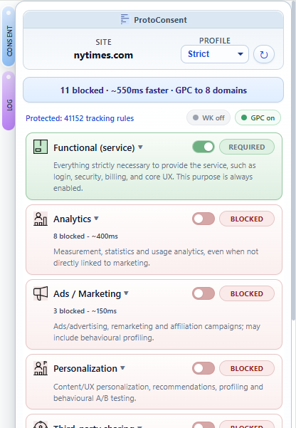

# ProtoConsent – How to test the extension

This document is part of the ProtoConsent project and is licensed under the Creative Commons Attribution-ShareAlike 4.0 International (CC BY-SA 4.0) license. See the repository README and the [LICENSE-CC-BY-SA](../LICENSE-CC-BY-SA) file for details.

This document explains how to try the current version of ProtoConsent in a browser using an unpacked extension, and how to observe its effects on real websites.

## Contents

- [ProtoConsent – How to test the extension](#protoconsent--how-to-test-the-extension)
  - [Contents](#contents)
  - [1. Requirements](#1-requirements)
  - [2. Installing the Extension (Developer Mode)](#2-installing-the-extension-developer-mode)
  - [3. Basic Test: Per‑Site Profile](#3-basic-test-persite-profile)
  - [4. Purpose Toggles and Visible Effects](#4-purpose-toggles-and-visible-effects)
  - [5. Example: Blocking Ads on elpais.com (DoubleClick)](#5-example-blocking-ads-on-elpaiscom-doubleclick)
    - [5.1 Baseline: Ads Allowed](#51-baseline-ads-allowed)
    - [5.2 Ads Blocked with ProtoConsent](#52-ads-blocked-with-protoconsent)
  - [6. Trying different sites, profiles and purposes](#6-trying-different-sites-profiles-and-purposes)
    - [6.1 Functional (service)](#61-functional-service)
    - [6.2 Analytics](#62-analytics)
    - [6.3 Ads / Marketing](#63-ads--marketing)
    - [6.4 Personalization / Profiling](#64-personalization--profiling)
    - [6.5 Third-party sharing](#65-third-party-sharing)
    - [6.6 Advanced tracking / fingerprinting](#66-advanced-tracking--fingerprinting)
  - [7. Testing the SDK query flow (content script bridge)](#7-testing-the-sdk-query-flow-content-script-bridge)
    - [7.1 Setup](#71-setup)
    - [7.2 Querying from the browser console](#72-querying-from-the-browser-console)
    - [7.3 Expected results](#73-expected-results)
    - [7.4 Security validation](#74-security-validation)
  - [8. Testing Global Privacy Control (Sec-GPC header)](#8-testing-global-privacy-control-sec-gpc-header)
    - [8.1 GPC active (default with Balanced or Strict)](#81-gpc-active-default-with-balanced-or-strict)
    - [8.2 GPC inactive (all privacy purposes allowed)](#82-gpc-inactive-all-privacy-purposes-allowed)
    - [8.3 Verifying rules from the service worker console](#83-verifying-rules-from-the-service-worker-console)
  - [9. Enabling the debug panel](#9-enabling-the-debug-panel)
    - [9.1 Activate debug mode](#91-activate-debug-mode)
    - [9.2 Deactivate debug mode](#92-deactivate-debug-mode)
  - [10. Testing site declarations (`.well-known/protoconsent.json`)](#10-testing-site-declarations-well-knownprotoconsentjson)
    - [10.1 Using demo.protoconsent.org](#101-using-demoprotoconsentorg)
    - [10.2 What to check](#102-what-to-check)
    - [10.3 Publishing your own declaration](#103-publishing-your-own-declaration)

## 1. Requirements

- **A Chromium‑based browser** (for example, Chrome, Edge or Brave)
- **Ability to load an unpacked extension** in developer mode
- **A few test sites** that use common analytics or ads/advertising services (for example, news sites)

## 2. Installing the Extension (Developer Mode)

2.1. **Clone the ProtoConsent repository locally:**

  ```bash
  git clone https://github.com/ProtoConsent/ProtoConsent.git
  cd ProtoConsent
  ```

  In this folder you should see the `extension/` directory (containing `manifest.json`, `background.js`, `pages/` with the popup, onboarding and settings UI, `config/`, `rules/` and `icons/`) and the `sdk/` directory.

2.2. **Load the extension in your browser:**

- Open the extensions page (for example `chrome://extensions/` or `edge://extensions/`).
- Enable **Developer mode**.
- Click **Load unpacked** and select the `extension/` folder inside the cloned repository (the one that contains `manifest.json`).
- Confirm that an extension called **ProtoConsent** appears in the extensions list and that it is enabled. Pin it in the toolbar if your browser supports pinning.

## 3. Basic Test: Per‑Site Profile

This first test checks that site rules are stored locally and correctly associated with each domain.

1. Visit any news or blog site of your choice.
2. Open the ProtoConsent popup from the browser toolbar.
3. Use the **Profile** selector to assign a profile to the current site (for example, “Strict” or “Balanced”).
4. Reload the page.
5. Open the popup again and confirm that the selected profile is still applied to this site.
6. If you repeat the same steps on a different domain, each site should keep its own profile.

Example popup view with profile and per‑purpose summary:


Expanded view with purpose toggles visible:



## 4. Purpose Toggles and Visible Effects

This test shows how changing purposes in ProtoConsent has direct, observable effects on network traffic.

1. On a site that uses web analytics, open the ProtoConsent popup.
2. Choose a profile (for example “Balanced”).
3. In the popup, make sure that **Functional (service)** remains **Allowed** and set **Analytics** to **Blocked** for this site.
4. Open your browser’s developer tools and go to the **Network** tab. Optionally filter by a common analytics domain (for example `google-analytics.com` or `analytics`).
5. Reload the page and observe the network requests. You should see that analytics requests that would normally be sent are now missing or reported as blocked.
6. Switch to a more permissive profile or enable **Analytics** for this site in the popup.
7. Reload again and confirm that analytics requests are now visible in the network log.

The goal is not to exhaustively test every tracker, but to see the cause‑and‑effect relationship between purpose toggles and network traffic.

## 5. Example: Blocking Ads on elpais.com (DoubleClick)

This example uses the Spanish news site <https://elpais.com/> to show how the **Ads / Marketing** purpose affects third‑party ad requests.

### 5.1 Baseline: Ads Allowed

1. Open <https://elpais.com/> in a new tab.
2. Open the ProtoConsent popup.
3. Ensure the **Profile** is set to a mode where **Ads / Marketing** is **Allowed** for elpais.com.
4. Open developer tools and go to the **Network** tab.
5. Use the filter box to search for `doubleclick` or `googlesyndication`.
6. Reload the page.
7. In the Network panel you should see requests to domains like `g.doubleclick.net`, `googleads.g.doubleclick.net` or `pagead2.googlesyndication.com` with status 200 (or similar).

### 5.2 Ads Blocked with ProtoConsent

1. With the same elpais.com tab open, switch back to the ProtoConsent popup.
2. Set **Ads / Marketing** to **Blocked** for elpais.com.
3. The extension updates its rules immediately.
4. Keep developer tools open on the Network tab, still filtered by `doubleclick`.
5. Reload the page.
6. Now you should see that some requests to `g.doubleclick.net`, `googleads.g.doubleclick.net` or `cm.g.doubleclick.net` fail with `net::ERR_BLOCKED_BY_CLIENT` or similar errors, indicating that the browser blocked them before they were completed.

Example screenshot with ads blocked:


Basic blocking of tracking resources for the **Ads** purpose on a news site: notice missing ad slots in the page header and `ERR_BLOCKED_BY_CLIENT` entries in the Network panel.

## 6. Trying different sites, profiles and purposes

To get a broader feeling for the ProtoConsent extension, you can combine site profiles with purpose-level tests.

- Repeat the tests above on several sites (for example, other news sites, blogs, or services that embed third‑party widgets).
- Try different profiles (“Strict”, “Balanced”, “Permissive”) to see how they translate into purpose states for each site.
- Experiment with per‑site overrides: start from a profile and then enable or disable a specific purpose manually.

Below are example scenarios for each purpose.

### 6.1 Functional (service)

**Goal:** Understand the role of the Functional purpose.

- Functional represents everything strictly necessary to provide the service (login, navigation, basic UX, billing, support).
- In this early version, Functional does not generate any blocking rules, even if you turn it off, to avoid breaking sites by accident.
- You can still use it as a reference to distinguish “core service” from optional analytics, ads or third‑party integrations.

### 6.2 Analytics

**Goal:** See how Analytics controls measurement and usage tracking.

- Reference domains (examples — full list in `extension/rules/block_*.json`): `google-analytics.com`, `scorecardresearch.com`, `chartbeat.com`, `fullstory.com`.

- Steps:
  1. Visit a site that uses Google Analytics or Segment.
  2. In the ProtoConsent popup, keep **Functional** allowed and set **Analytics** to *Blocked* for this site.
  3. Open DevTools → **Network**, filter by `google-analytics` or `segment`.
  4. Reload the page and verify that these requests are missing or reported as `ERR_BLOCKED_BY_CLIENT`.
  5. Switch **Analytics** back to *Allowed*, reload and confirm that the requests reappear with status 200.

### 6.3 Ads / Marketing

**Goal:** Observe the impact on advertising traffic.

- Reference domains (examples — full list in `extension/rules/block_*.json`): `doubleclick.net`, `googlesyndication.com`, `adservice.google.com`, `criteo.com`, `taboola.com`.

- Steps:
  1. Use a site with visible ads (for example, a major news site).
  2. With **Ads / Marketing** set to *Allowed*, open **Network** and filter by `doubleclick` or `googlesyndication`. Confirm that requests return 200.
  3. Set **Ads / Marketing** to *Blocked* for this site.
  4. Reload and check that the same requests now disappear or are shown as blocked (for example `ERR_BLOCKED_BY_CLIENT`).

### 6.4 Personalization / Profiling

**Goal:** Separate basic ads from more advanced personalization or retargeting.

- Reference domains (examples — full list in `extension/rules/block_*.json`): `bluekai.com`, `crwdcntrl.net`, `acxiom.com`, `barilliance.com`, `audigent.com`.

- Steps:
  1. On a site with banners and personalised or retargeted ads, keep **Ads / Marketing** allowed but set **Personalization / Profiling** to *Blocked*.
  2. Filter in **Network** by `bluekai`, `crwdcntrl`, `audigent`.
  3. Reload and compare the results with the case where Personalization is also allowed.
  4. This will not be perfect on every site, but it shows that ProtoConsent treats personalization as a separate purpose from “basic ads”.

### 6.5 Third-party sharing

**Goal:** Highlight third‑party data sharing and integrations.

- Reference domains (examples — full list in `extension/rules/block_*.json`): `connect.facebook.net`, `addthis.com`, `addtoany.com`, `intercom.io`, `disqus.com`.

- Steps:
  1. Choose a site that embeds social widgets, Hotjar or Microsoft/Bing tracking.

  2. Allow **Functional** and **Analytics**, but set **Third‑party sharing** to *Blocked*.
  3. Filter by `facebook.net`, `addthis`, `intercom` or `disqus` in **Network**.
  4. Reload and compare the results with the case where Third‑party sharing is also allowed.

### 6.6 Advanced tracking / fingerprinting

**Goal:** Target more advanced monitoring or experimentation tools.

- Reference domains (examples — full list in `extension/rules/block_*.json`): `js-agent.newrelic.com`, `cdn.optimizely.com`, `fpnpmcdn.net`, `datadome.co`, `arkoselabs.com`.

- Steps:
  1. Visit a site that uses New Relic, Heap, Optimizely or similar tooling.
  2. Set **Advanced tracking / fingerprinting** to *Blocked* and keep the other purposes allowed.
  3. Filter in **Network** by `newrelic`, `nr-data`, `heapanalytics` or `optimizely`.
  4. Reload and check whether those requests are blocked; then switch Advanced tracking back to *Allowed* and confirm that they return to 200 responses.

These scenarios are not meant to be exhaustive, but to show that ProtoConsent already offers a consistent, browser‑level way to express and enforce purpose‑based preferences across real websites.

## 7. Testing the SDK query flow (content script bridge)

This test verifies that a web page can query the user's consent preferences through the ProtoConsent SDK protocol. The extension injects a content script on every page that bridges SDK queries to the extension's storage.

### 7.1 Setup

1. Make sure the extension is loaded and reloaded after any code changes (see section 2).
2. Open any website (for example `wikipedia.org`).
3. Use the ProtoConsent popup to set a profile and adjust purposes for this site.

### 7.2 Querying from the browser console

Open DevTools (F12) and go to the **Console** tab. Paste the following helper function:

```js
function testQuery(action, purpose) {
  const id = crypto.randomUUID();
  return new Promise((resolve) => {
    const timer = setTimeout(() => resolve('TIMEOUT'), 600);
    window.addEventListener('message', function handler(event) {
      if (event.data && event.data.type === 'PROTOCONSENT_RESPONSE' && event.data.id === id) {
        clearTimeout(timer);
        window.removeEventListener('message', handler);
        resolve(event.data.data);
      }
    });
    window.postMessage({ type: 'PROTOCONSENT_QUERY', id, action, purpose }, window.location.origin);
  });
}
```

Then run these queries one at a time:

```js
await testQuery('get', 'analytics')
```

You can replace `'analytics'` with any valid purpose key: `functional`, `analytics`, `ads`, `personalization`, `third_parties`, `advanced_tracking`.

```js
await testQuery('getAll')
```

```js
await testQuery('getProfile')
```

### 7.3 Expected results

- `get('analytics')` returns `true` or `false` depending on the purpose state for this site.
- `getAll()` returns an object with a boolean property per purpose, resolved from the active profile plus any overrides.
- `getProfile()` returns the profile name (`"strict"`, `"balanced"` or `"permissive"`).

On a site with no explicit configuration, the results reflect the default profile (currently balanced).

### 7.4 Security validation

These queries should be rejected by the content script:

```js
await testQuery('delete', null)
```

Expected: `TIMEOUT` (invalid action, ignored by the content script).

```js
await testQuery('get', 'malware')
```

Expected: `null` (invalid purpose, the extension has no data for it).

## 8. Testing Global Privacy Control (Sec-GPC header)

ProtoConsent conditionally sends a `Sec-GPC: 1` HTTP request header when privacy-relevant purposes are denied for a site. The purposes that trigger GPC are marked with `triggers_gpc: true` in `extension/config/purposes.json` (currently: ads, third_parties, advanced_tracking).

### 8.1 GPC active (default with Balanced or Strict)

1. Open a site (for example `elpais.com`) with the default Balanced profile.
2. Open DevTools → **Network**, reload the page.
3. Click the first request (the HTML document).
4. In **Request Headers**, look for `Sec-GPC: 1`. It should be present because Balanced denies ads, third_parties and advanced_tracking.

### 8.2 GPC inactive (all privacy purposes allowed)

1. In the ProtoConsent popup, set the site to a custom profile with all purposes allowed.
2. Reload the page.
3. Check **Request Headers** again. `Sec-GPC` should **not** appear.

### 8.3 Verifying rules from the service worker console

Open the service worker console for the extension and run:

```js
chrome.declarativeNetRequest.getDynamicRules().then(r => {
  const block = r.filter(x => x.action.type === 'block');
  const allow = r.filter(x => x.action.type === 'allow');
  const gpc = r.filter(x => x.action.type === 'modifyHeaders');
  console.log('Block:', block.length, '| Allow:', allow.length, '| GPC:', gpc.length);
  gpc.forEach(x => console.log(' ',
    x.action.requestHeaders[0].operation,
    x.condition.requestDomains || 'GLOBAL'));
})
```

With Balanced as the default and one site set to custom (all allowed), the expected output is:

- `Block: 0 | Allow: 3 | GPC: 2`
- The 3 allow rules are per-site overrides for the categories that Balanced blocks globally (ads, third_parties, advanced_tracking), allowing them on the custom site.
- `set GLOBAL` — the global GPC rule (privacy purposes denied by Balanced)
- `remove ["example.com"]` — the per-site override that suppresses GPC for the permissive site

## 9. Enabling the debug panel

The popup includes a hidden debug panel that shows internal state (dynamic rules, ruleset toggles, GPC mappings). It is off by default and controlled by a flag in local storage — no code changes needed.

### 9.1 Activate debug mode

1. Open the ProtoConsent popup, right-click it and choose **Inspect** to open its DevTools console.
2. Run:

   ```js
   chrome.storage.local.set({ debug: true })
   ```

3. Close and reopen the popup. A **Debug** section should appear at the bottom, and the **Debug** inner tab becomes visible in the Log view.

> **Tip:** You can also run this command from the service worker console, but make sure you use a **live** console: after reloading the extension from `chrome://extensions/`, the previous SW console is disconnected and commands typed there will silently fail. Click **Inspect** on the service worker entry again to open a fresh console.

### 9.2 Deactivate debug mode

1. In the same console (popup Inspect or a live SW console), run:

   ```js
   chrome.storage.local.remove("debug")
   ```

2. Close and reopen the popup. The debug panel and Log debug tab disappear.

The flag persists across browser restarts until explicitly removed.

## 10. Testing site declarations (`.well-known/protoconsent.json`)

ProtoConsent reads a `.well-known/protoconsent.json` file from any website to display the site's declared data practices in a side panel. The easiest way to test this is with the public demo site.

### 10.1 Using demo.protoconsent.org

1. Make sure the extension is loaded (see section 2).
2. Open <https://demo.protoconsent.org> in a new tab.
3. Open the ProtoConsent popup from the toolbar.
4. Click the **Site** tab (side panel toggle) in the popup header.
5. The side panel should show the site's declaration with [Consent Commons](https://consentcommons.com/) icons, including purposes, legal bases, providers, sharing scope, and data handling details.

### 10.2 What to check

- Each declared purpose shows its legal basis, provider, and sharing scope (if declared).
- Purposes with `"used": false` are shown as not used.
- The `rights_url` field links to the site's data rights page.
- The declaration indicator (pill) in the popup header should be active (blue dot) when a valid declaration is found.

### 10.3 Publishing your own declaration

Any site can publish a `.well-known/protoconsent.json` file. See the [site declaration spec](well-known-spec.md) for the full format and the [demo site source](https://github.com/ProtoConsent/demo) for a complete example.

